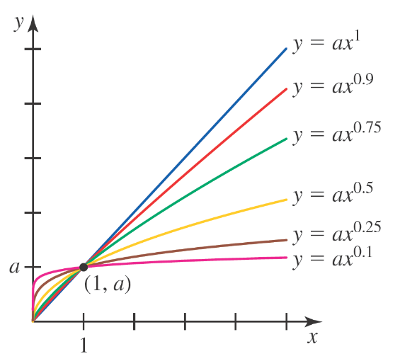

## Module 1 - Modeling With Other Types of Functions

<!-- TOC -->
  * [Module 1 - Modeling With Other Types of Functions](#module-1---modeling-with-other-types-of-functions)
* [Power Functions](#power-functions)
  * [General Notes](#general-notes)
    * [Video Resources](#video-resources)
      * [Direct and Inverse Variation](#direct-and-inverse-variation)
      * [Inverse Variation Application](#inverse-variation-application)
      * [Direct Variation Application](#direct-variation-application)
    * [Power Function Behavior - Rate of Change](#power-function-behavior---rate-of-change)
  * [Power Functions Definition](#power-functions-definition)
  * [Solving Power Functions](#solving-power-functions)
    * [Method 1 - Graphing](#method-1---graphing)
    * [Method 2 - Algebraically](#method-2---algebraically)
  * [Rational Exponents and Radicals](#rational-exponents-and-radicals)
  * [Power Function Graph - **x &ge; 0** and **0 < b < 1**](#power-function-graph---x-ge-0-and-0--b--1)
  * [Power Function Graph - **x > 0** and **b < 0**](#power-function-graph---x--0-and-b--0)
  * [Direct and Inverse Variation](#direct-and-inverse-variation-1)
    * [Direct Variation](#direct-variation)
    * [Inverse Variation](#inverse-variation)
    * [Real-world examples](#real-world-examples)
  * [Negative Exponents](#negative-exponents)
  * [Inverses of Power Functions](#inverses-of-power-functions)
  * [Power Function Regression on a Calculator](#power-function-regression-on-a-calculator)
  * [Math Examples](#math-examples)
    * [Math Example 1](#math-example-1)
    * [Math Example 2](#math-example-2)
    * [Math Example 3](#math-example-3)
<!-- TOC -->

# Power Functions

## General Notes

### Video Resources

#### Direct and Inverse Variation

- **Direct Variation:** Scaling up **x** or **y** also scales the opposite
  by the same factor.
    - _I.e. If **x** is doubled, **y** is doubled._
- **Inverse Variation:** Scaling up **x** or **y** inversely scales the opposite
  by the same factor.
    - _I.e. If **x** is doubled, **y** is halved._
- As seen in the video and image, the equation can be rewritten in various ways
  to fool the reader. Because of this, always try to simplify the equation to
  either:
    - **Direct Variation:** **y = kx**
    - **Inverse Variation:** **y = k&frasl;x**

---

#### Inverse Variation Application

> **Full problem:**
>
> On a string instrument, the length of a string varies inversely as the
> frequency of its vibrations (the vibrations are what give string instruments
> their sound!).
>
> An 11-inch string has a frequency of 400 cycles per second. Find the constant
> of proportionality, and then find the frequency of a 10-inch string.

---

#### Direct Variation Application

---

### Power Function Behavior - Rate of Change

Rate of change can describe power functions in the following ways:

1. **Identifying Increases or Decreases**
    - The rate of change can tell us whether a power function is increasing or
      decreasing.
    - A **positive** rate of change means that the function is **increasing**.
    - A **negative** rate of change indicates that it is **decreasing**.
2. **Describing Speed of Change**
    - The magnitude _(or absolute value)_ of the rate of change describes how
      quickly the function is increasing or decreasing.
    - A larger rate of change means that the function is changing more rapidly.
3. **Derivative of Power Functions**
    - The rate of change of a power function is represented by its derivative.
    - For a power function of the form **y = axn**, the derivative is
      **y' = nax(n-1)**. This gives the rate of change of the
      function at any point.
4. **Understanding the Shape**
    - The second derivative (rate of change of the rate of change) helps us
      understand the shape of a power function graph.
    - If the second derivative is constantly **positive**, the graph of the
      function is **concave up**.
    - If the second derivative is constantly **negative**, the graph is
      **concave down**.
5. **Analyzing Turning Points**
    - In power functions, turning points occur where the derivative (rate of
      change) is zero.
6. **Behavior at Infinity**
    - The behavior of a power function as it approaches infinity or negative
      infinity depends on the power. For example, if the power is positive, the
      function tends towards infinity as x approaches infinity. If the power is
      negative, the function tends towards zero as x approaches infinity.
7. **Predicting Future Values**
    - The derivative at a point can give us information about the function's
      behavior near that point. However, it's not generally accurate to say that
      it allows us to predict future values of the function, especially for
      non-linear functions like power functions.
8. **Rate of Change in Real World Contexts**
    - In real world applications, the rate of change of power functions can
      represent a variety of phenomena, such as the growth or decay of a
      population, the spread of a disease, or the change in velocity of an
      object. However, the specific interpretation of the rate of change depends
      on the context and the specific power function being considered.

## Power Functions Definition

A function with the equation of the form:

> **y = axb**

where **a** and **b** are constants, is called a **power function**.

- The main difference between a power function and a polynomial function is that
  in a power function the exponent, **b**, can be any real number rather than
  just a positive integer.
- A power function is a single-term function, whereas a polynomial function may
  have multiple terms.

## Solving Power Functions

### Method 1 - Graphing

1. Input the table of values into Desmos and then use power regression to find
   the
   equation of the function.
    - The formula is: **y = axb**
2. **a** is the slope of the line and **b** is the exponent.
3. Example: **y = 9.30693x0.12**

### Method 2 - Algebraically

## Rational Exponents and Radicals

## Power Function Graph - **x &ge; 0** and **0 < b < 1**

## Power Function Graph - **x > 0** and **b < 0**

## Direct and Inverse Variation

Given a power function of the form **y = axb** with **a > 0**.

- If <u>**b > 0**</u>, then it is an <u>**increasing**</u> function and
  **xb** and **y** vary <u>**directly**</u>.
- If <u>**b < 0**</u>, then it is a <u>**decreasing**</u> function and
  **xb** and **y** vary <u>**inversely**</u>.

When determining if a power function should be used to model a set of data, look
for signs of direct or inverse variation power functions.

### Direct Variation

Given a power function of the form **y = axb** with **a > 0**.

It is Said as either:

- _"**y** varies directly with **xb**"_
- "_**y** is directly proportional to **xb**_"

**a** is called the <u>**constant of proportionality**</u>.

### Inverse Variation

The power function with **b < 0** should be rewritten from
**y = axb** to **y = ax&minus;c**,
where **c** is a positive number equal to **|&hairsp;b&hairsp;|**.

- Alternate form useful for interpreting inverse variation.

Given a power function of the form (with **c > 0**):

It is Said as either:

- _"**y** varies inversely with **xc**"_
- "_**y** is inversely proportional to **xc**_"

**a** is called the <u>**constant of proportionality**</u>.

### Real-world examples

| Related Quantities                                                                              |                       Formula                       | In Words                                                                                                                                                                                                                        |
|-------------------------------------------------------------------------------------------------|:---------------------------------------------------:|:--------------------------------------------------------------------------------------------------------------------------------------------------------------------------------------------------------------------------------|
| Cost of a fuel purchase and the amount of fuel bought                                           |                     **C = kg**                      | The cost of a fuel purchase is directly proportional to the amount of fuel bought (purchased in **gallons**). **k** is the constant of proportionality and represents the fuel price per gallon.                                |
| Area of a circle and its radius                                                                 |              **A = &pi;r2**              | The area of a circle is directly proportional to the square of its **radius**. &pi; is the constant of proportionality.                                                                                                         |
| Blood flow in an artery and the radius of the artery                                            |               **F = kr4**                | The rate at which blood flows in an artery (in **mL per minute**) is directly proportional to the fourth power of the **radius** of the artery. **k** is the constant of proportionality.                                       |
| Average earnings per hour when paid a fixed amount of money to complete a task and hours worked |       **A = k&frasl;x**       | The average earnings per hour, **k**, is inversely proportional to the amount of money to complete a task and hours worked. **x** is the constant of proportionality and represents the fixed amount of money paid for the job. |
| Length of a 4-cubic-foot box with equal height and width and box width                          | **L = 4&frasl;w2** | The length of a box, **L**, with equal height and width, **w**, is inversely proportional to the square of the width with a constant of proportionality, **4**.                                                                 |

## Negative Exponents

## Inverses of Power Functions

Power functions that are strictly increasing or decreasing will have an
inverse function.

Given: **&fnof;(x) = axn**

- _inverse variation_ and _inverse function_ are not the same thing.

## Power Function Regression on a Calculator

## Math Examples

- If you are asked to fill in a table based on the representation of a power function, fill in fractions rather than decimals.

### Math Example 1

- _k_ is the constant of proportionality.

A quantity **W** is inversely proportional to the square root of a quantity 
**n**.

1. Write out the base equation &rarr; **W(n) = k&radic;n**
2. Rewrite the radical as a rational exponent &rarr; **W(n) = kn1/2**
3. Because it is looking for the inverse the equation goes from **y = axb** &rarr; **y = ax-c**.
   - Where **c** is a positive number equal to **|&hairsp;b&hairsp;|**.
4. Final answer &rarr; **W(n) = kn&minus;1/2**

### Math Example 2

Solve the given equation: **4x3/2 = 20**

1. Divide both sides by **4** &rarr; **x3/2 = 5**
2. Rewrite the equation as either: 
   1. **(x3)1&frasl;2 = 5**
   2. **&radic;x3 = 5**
3. Square both sides &rarr; **x3 = 25**
4. Take the cube root of both sides &rarr; **x = 3&radic;5**
5. Final answer &rarr; **x = 2.924017738212866** &approx; **2.924**

### Math Example 3

Solve the given equation: **10x&minus;2.5 = 60**

1. Divide both sides by **10** &rarr; **x&minus;2.5 = 6**
2. Rewrite the equation as &rarr; **1&frasl;x2.5 = 6**
3. Multiply both sides by the reciprocal of **1&frasl;x2.5** &rarr; **1 = 6x2.5**
4. Divide both sides by **6** &rarr; **1&frasl;6 = x2.5**
5. Rewrite the equation as &rarr; **2.5&radic;(&frac16;) = x**
6. Final answer &rarr; **x = 0.4883593419 &approx; 0.488**

# Power Functions

