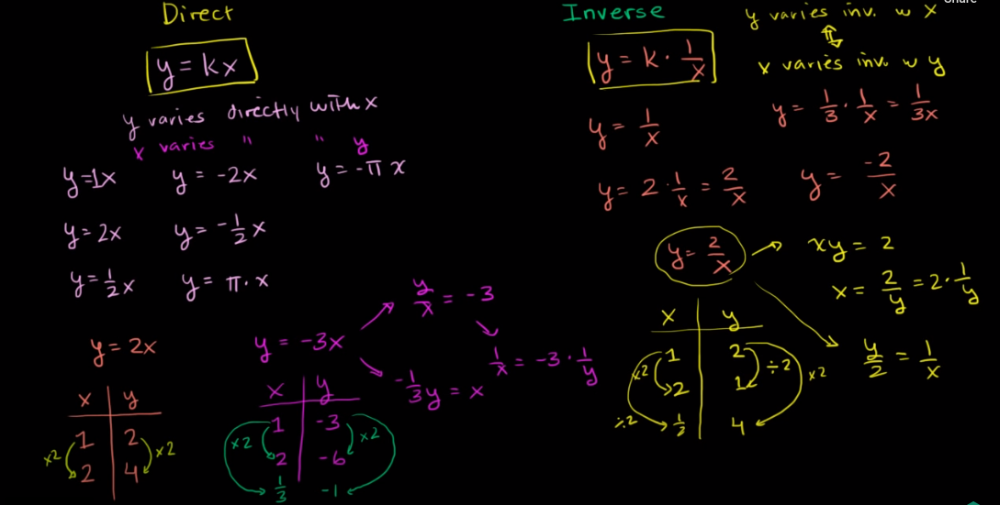
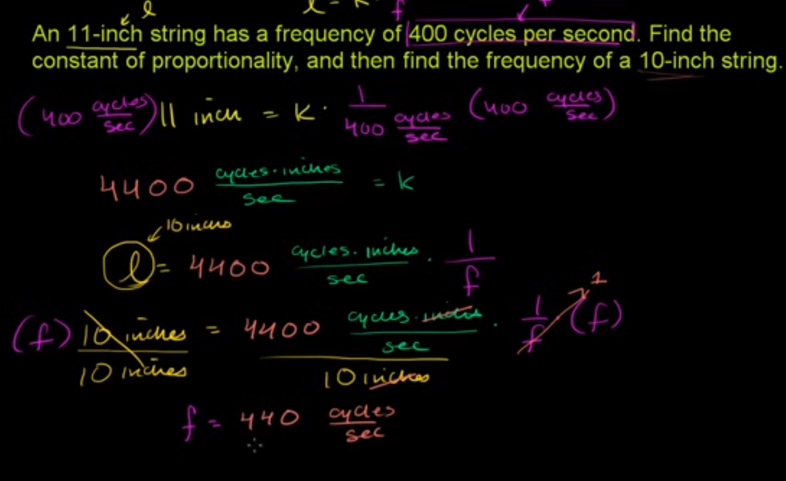
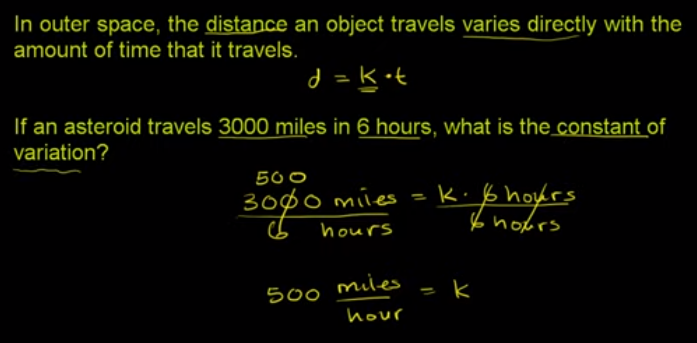
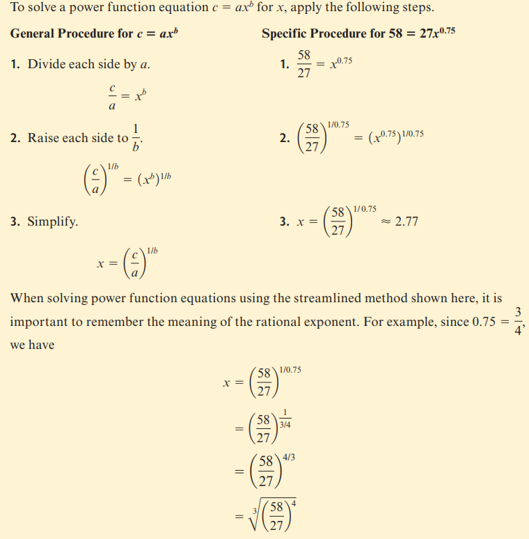
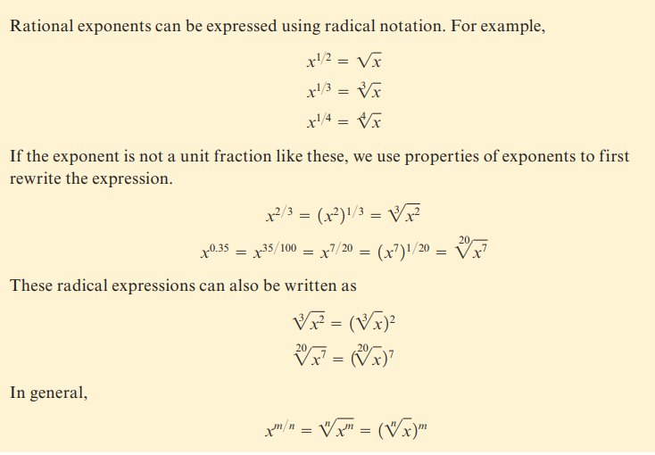
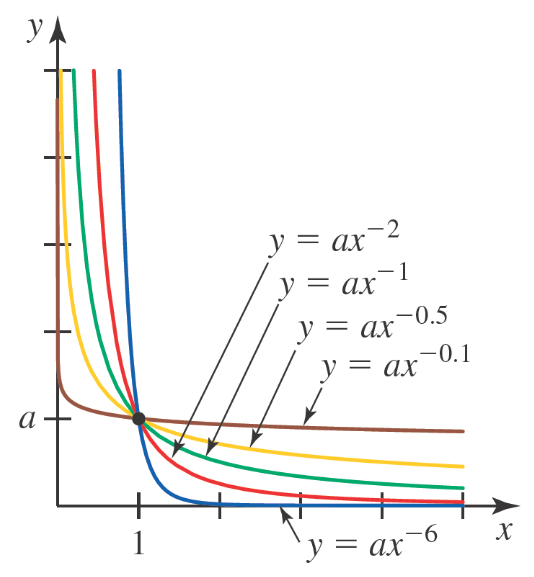
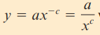
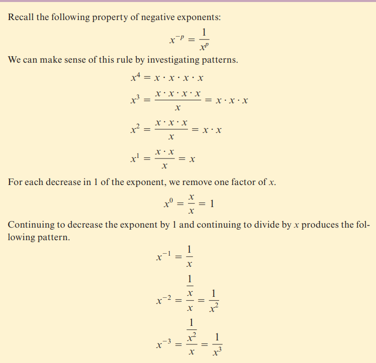
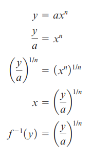

# Module 1 - Modeling With Other Types of Functions

<!-- TOC -->
* [Module 1 - Modeling With Other Types of Functions](#module-1---modeling-with-other-types-of-functions)
* [General Notes](#general-notes)
  * [Video Resources](#video-resources)
    * [Direct and Inverse Variation](#direct-and-inverse-variation)
    * [Inverse Variation Application](#inverse-variation-application)
    * [Direct Variation Application](#direct-variation-application)
* [Power Functions Definition](#power-functions-definition)
* [Solving Power Functions](#solving-power-functions)
  * [Method 1 - Graphing](#method-1---graphing)
  * [Method 2 - Algebraically](#method-2---algebraically)
* [Rational Exponents and Radicals](#rational-exponents-and-radicals)
* [Power Function Graph - `x > 0` and `b < 0`](#power-function-graph---x--0-and-b--0)
* [Direct and Inverse Variation](#direct-and-inverse-variation-1)
  * [Direct Variation](#direct-variation)
  * [Inverse Variation](#inverse-variation)
  * [Real-world examples](#real-world-examples)
* [Negative Exponents](#negative-exponents)
* [Inverses of Power Functions](#inverses-of-power-functions)
* [Power Function Regression on a Calculator](#power-function-regression-on-a-calculator)
<!-- TOC -->

# General Notes

## Video Resources

### Direct and Inverse Variation

- **Direct Variation:** Scaling up **x** or **y** also scales the opposite
  by the same factor.
    - _I.e. If **x** is doubled, **y** is doubled._
- **Inverse Variation:** Scaling up **x** or **y** inversely scales the opposite
  by the same factor.
    - _I.e. If **x** is doubled, **y** is halved._
- As seen in the video and image, the equation can be rewritten in various ways
  to fool the reader. Because of this, always try to simplify the equation to
  either:
    - **Direct Variation:** **y = kx**
    - **Inverse Variation:** **y = k&frasl;x**

---

### Inverse Variation Application

> **Full problem:**
>
> On a string instrument, the length of a string varies inversely as the
> frequency of its vibrations (the vibrations are what give string instruments
> their sound!).
>
> An 11-inch string has a frequency of 400 cycles per second. Find the constant
> of proportionality, and then find the frequency of a 10-inch string.

---

### Direct Variation Application

---

# Power Functions Definition

A function with the equation of the form:

> **y = axb**

where **a** and **b** are constants, is called a **power function**.

- The main difference between a power function and a polynomial function is that
  in a power function the exponent, **b**, can be any real number rather than
  just a positive integer.
- A power function is a single-term function, whereas a polynomial function may
  have multiple terms.

# Solving Power Functions

## Method 1 - Graphing

1. Input the table of values into Desmos and then use power regression to find
   the
   equation of the function.
    - The formula is: **y = axb**
2. **a** is the slope of the line and **b** is the exponent.
3. Example: **y = 9.30693x0.12**

## Method 2 - Algebraically

# Rational Exponents and Radicals

# Power Function Graph - `x > 0` and `b < 0`

# Direct and Inverse Variation

Given a power function of the form **y = axb** with **a > 0**.

- If <u>**b > 0**</u>, then it is an <u>**increasing**</u> function and
  **xb** and **y** vary <u>**directly**</u>.
- If <u>**b < 0**</u>, then it is a <u>**decreasing**</u> function and
  **xb** and **y** vary <u>**inversely**</u>.

When determining if a power function should be used to model a set of data, look
for signs of direct or inverse variation power functions.

## Direct Variation

Given a power function of the form **y = axb** with **a > 0**.

It is Said as either:

- _"**y** varies directly with **xb**"_
- "_**y** is directly proportional to **xb**_"

**a** is called the <u>**constant of proportionality**</u>.

## Inverse Variation

The power function with **b < 0** should be rewritten from 
**y = axb** to **y = ax&minus;c**,
where **c** is a positive number equal to **|&hairsp;b&hairsp;|**.

- Alternate form useful for interpreting inverse variation.

Given a power function of the form (with **c > 0**):

It is Said as either:

- _"**y** varies inversely with **xc**"_
- "_**y** is inversely proportional to **xc**_"

**a** is called the <u>**constant of proportionality**</u>.

## Real-world examples

| Related Quantities                                                                              |                       Formula                       | In Words                                                                                                                                                                                                                        |
|-------------------------------------------------------------------------------------------------|:---------------------------------------------------:|:--------------------------------------------------------------------------------------------------------------------------------------------------------------------------------------------------------------------------------|
| Cost of a fuel purchase and the amount of fuel bought                                           |                     **C = kg**                      | The cost of a fuel purchase is directly proportional to the amount of fuel bought (purchased in **gallons**). **k** is the constant of proportionality and represents the fuel price per gallon.                                |
| Area of a circle and its radius                                                                 |              **A = &pi;r2**              | The area of a circle is directly proportional to the square of its **radius**. &pi; is the constant of proportionality.                                                                                                         |
| Blood flow in an artery and the radius of the artery                                            |               **F = kr4**                | The rate at which blood flows in an artery (in **mL per minute**) is directly proportional to the fourth power of the **radius** of the artery. **k** is the constant of proportionality.                                       |
| Average earnings per hour when paid a fixed amount of money to complete a task and hours worked |       **A = k&frasl;x**       | The average earnings per hour, **k**, is inversely proportional to the amount of money to complete a task and hours worked. **x** is the constant of proportionality and represents the fixed amount of money paid for the job. |
| Length of a 4-cubic-foot box with equal height and width and box width                          | **L = 4&frasl;w2** | The length of a box, **L**, with equal height and width, **w**, is inversely proportional to the square of the width with a constant of proportionality, 4.                                                                     |

# Negative Exponents

# Inverses of Power Functions

Power functions that are strictly increasing or decreasing will have an
inverse function.

Given: **&fnof;(x) = axn**

- _inverse variation_ and _inverse function_ are not the same thing.

# Power Function Regression on a Calculator

