# Module 2 - Rational Functions

<!-- TOC -->
* [Module 2 - Rational Functions](#module-2---rational-functions)
* [General Notes](#general-notes)
* [Rational Functions](#rational-functions)
* [Asymptotes](#asymptotes)
  * [Vertical Asymptotes](#vertical-asymptotes)
    * [VA Example Problem 1](#va-example-problem-1)
    * [How to Find Vertical Asymptotes](#how-to-find-vertical-asymptotes)
      * [Another Example](#another-example)
  * [Horizontal Asymptotes](#horizontal-asymptotes)
    * [How to Find Horizontal Asymptotes](#how-to-find-horizontal-asymptotes)
* [Removable Discontinuities (Holes)](#removable-discontinuities-holes)
  * [How to Find Removable Discontinuities (Holes)](#how-to-find-removable-discontinuities-holes)
* [Drawing a Rational Function Graph by Hand](#drawing-a-rational-function-graph-by-hand)
* [Inverses of Rational Functions](#inverses-of-rational-functions)
  * [Example of Finding The Inverse of a Rational Function](#example-of-finding-the-inverse-of-a-rational-function)
<!-- TOC -->

# General Notes

- For more information, refer to previous notes
  in [MAT151 of 2023](https://github.com/TheNoteTaker/2023_spring_mat151/blob/main/units/unit_03_function_transformations_quadratic_polynomial_and_rational_functions/notes.md#module-12---rational-functions)
- Remember to always factor both numerator and denominator before simplifying
  rational functions. This will help with accurately finding things like the
  domain.

# Rational Functions

When one polynomial function is divided by another, a rational function is
created.

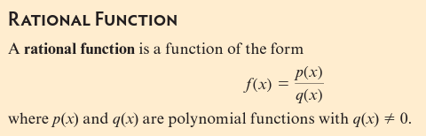

# Asymptotes

## Vertical Asymptotes

A vertical asymptote defines an imaginary _boundary_ for the function:

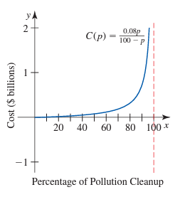

A vertical asymptote of a function **&fnof;(x)** is a vertical line,
**x = a**, that the graph of **&fnof;(x)** approaches but does not cross.

- _More formally:_ As **x** approaches **a**, &fnof;(x)
  approaches **&pm;&infin;**.
- _Symbolically:_ **x &rarr; a, &fnof;(x) &rarr; &pm;&infin;**

Vertical asymptotes are not part of the graph of a rational function, but are
often drawn because they are helpful in describing how the function behaves.

### VA Example Problem 1

Given **C(p) = 0.08p&frasl;100 - p**, where **C** is cost
in billions of dollars.

1. Create a table from 0 to 100 (practical domain) in increments of 25 by
   plugging in each value into the equation for **p**, **C**, and **&Delta;C**.

| Percent of Pollution Removed (p) | Cost ($ billions) (C) | Change in the Cleanup Cost ($ billions) (&Delta;C) |
|:----------------------------------------:|:-----------------------------:|:----------------------------------------------------------:|
|                    0                     |               0               |                          0.02667                           |
|                    25                    |            0.02667            |                          0.05333                           |
|                    50                    |            0.08000            |                          0.16000                           |
|                    75                    |            0.24000            |                          unknown                           |
|                   100                    |           undefined           |                                                            |

2. We can see that the rate of change is increasing at an increasing rate.
3. When we tried to calculate **C(100)**, it came back _undefined_.
4. Because **C(p)** is undefined at **p = 100**, it may be a **vertical
   asymptote**.
5. To verify if it is a vertical asymptote we need to confirm that **p &rarr;
   100, C(p) &rarr; &infin;**. One way is to create a table of
   values for **C(p)** and for the **&Delta;C** near **C(p) = 100**

| Percent of  Pollution Removed P | Cost ($ billions) C | Rate of Change ($ billions per percent) &Delta;C&frasl;&Delta;p |
|:---------------------------------------:|:---------------------------:|:---------------------------------------------------------------------------------------------:|
|                   93                    |            1.06             |                                             0.19                                              |
|                   94                    |            1.25             |                                             0.27                                              |
|                   95                    |            1.52             |                                             0.40                                              |
|                   96                    |            1.92             |                                             0.67                                              |
|                   97                    |            2.59             |                                             1.33                                              |
|                   98                    |            3.92             |                                             4.00                                              |
|                   99                    |            7.92             |                                       Cannot calculate                                        |
|                   100                   |          Undefined          |                                                                                               |

### How to Find Vertical Asymptotes

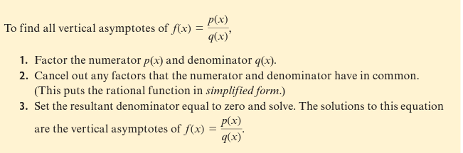

---

For example, for the graph of:

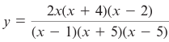

The vertical asymptotes can be found by:

1. **(x - 1) = 0 &rarr; x = 1**
2. **(x + 5) = 0 &&rarr; x = -5**
3. **(x - 5) = 8 &rarr; x = 5**

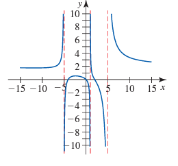

#### Another Example

First, factor the function:

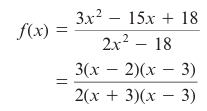

**(x - 3)** is in both the numerator and denominator, so as long as
**x &ne; 3**, **x - 3&frasl;x - 3 = 1**.

The simplified version is:

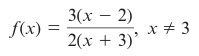

- A **removable discontinuity** occurs at **x = 3**.

Wrapping it up by graphing the function:

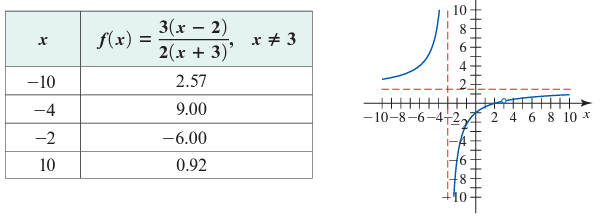

## Horizontal Asymptotes

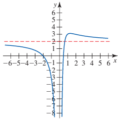

- A **horizonal asymptote** of a function **&fnof;** is a horizontal line that
  the graph of **fnof;** approaches as **x** approaches **&pm;&infin;**.
    - _More formally:_ A horizontal asymptote occurs at **y = b** <u>only if</u>
      the graph of **&fnof;** approaches **y = b** as **x** approaches
      **&pm;&infin;**.
- Graphs can have both horizontal and vertical asymptotes.
- Horizontal asymptotes of rational functions are a line, **y = b**, that the
  function approaches as the independent variables approaches **&pm;&infin;**.
- To find the horizontal asymptote, you need to know how the end-behavior of a
  function.

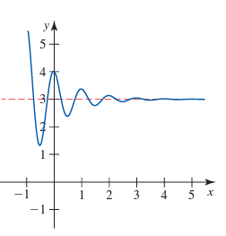

- In this example graph, the line oscillates _(moves back and forth)_, but as
  **x &rarr; &infin;, &fnof;(x) &rarr; 3**.

### How to Find Horizontal Asymptotes

_Reminder_: The leading coefficient is the coefficient of the term with the the
largest exponent. As **x &rarr; &pm;&infin;**, the graph will be more and more
influenced by the _leading term_.

- For values of **x** near **&pm;&infin;, &fnof;(x) &approx; ax
  n&frasl;bxm**.

<u>Example Functions:</u>

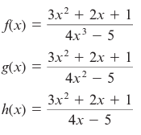

Using the ratio of the leading terms in the above functions to approximate the
value of each function:

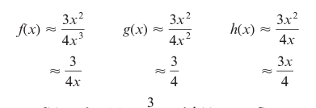

1. As **&fnof;(x) &rarr; &infin;, &fnof;(x) &rarr; 0 | HA: y = 0**
2. As **g(x) &rarr; &infin;, g(x) &rarr; 3&frasl;4 | HA:
   y = 3&frasl;4**
3. As **h(x) &rarr; &infin;, h(x) &rarr; &infin; | HA: None**

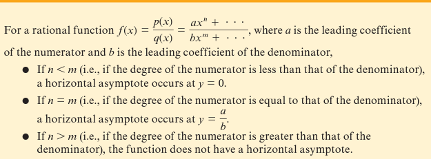

# Removable Discontinuities (Holes)

Given:

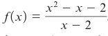

The function is defined at **x = 2**, yet looks linear when graphed:

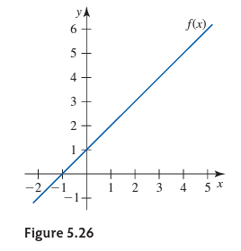

To find and graph the **removable discontinuity** find the formula of the graph
by factoring the numerator and denominator and simplifying.

The formula is: **y = x + 1**.

The line contains the point **(2, 3)**, but the graph of **&fnof** doesn't.

- _Said as:_ The graph of **&fnof;** has a **removable discontinuity** _(a
  hole)_ in at the point **(2, 3)**

Removable discontinuities are shown in a graph as empty circles:

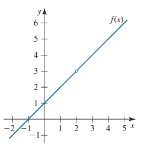

## How to Find Removable Discontinuities (Holes)

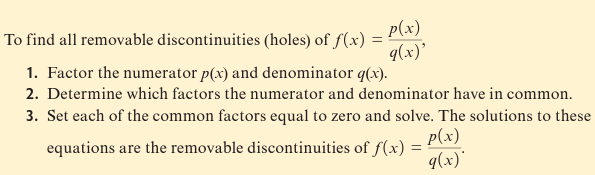

# Drawing a Rational Function Graph by Hand

If you know the **x-intercepts**, **y-intercepts**, **vertical asymptotes**, and
**horizontal asymptotes** of a rational function, you can sketch its graph by
hand.

# Inverses of Rational Functions

- A rational function that is strictly increasing or strictly decreasing will
  have an inverse function.
- A rational function that is changes from increasing to decreasing or vice
  versa will not have an inverse function.
- The process of finding the inverse of a rational function is algebraically
  complex.

## Example of Finding The Inverse of a Rational Function

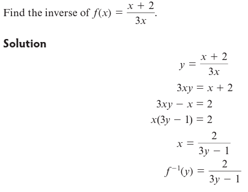
