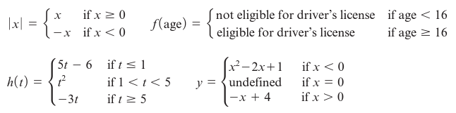

# Module 3 - Piecewise Functions

<!-- TOC -->

* [Module 3 - Piecewise Functions](#module-3---piecewise-functions)
* [General Notes](#general-notes)
* [Piecewise Functions](#piecewise-functions)
    * [Piecewise Function Structure Examples](#piecewise-function-structure-examples)
    * [Example of Discontinuous Piecewise Function](#example-of-discontinuous-piecewise-function)
        * [Table](#table)
        * [Graph](#graph)
* [Using Regression to Create a Piecewise Function](#using-regression-to-create-a-piecewise-function)
    * [Table](#table-1)
    * [Graph](#graph-1)
    * [Solution](#solution)
        * [Section One](#section-one)
        * [Section Two](#section-two)
        * [Section Three](#section-three)
        * [Final Piecewise Function](#final-piecewise-function)
* [Graphing a Piecewise Function from an Equation](#graphing-a-piecewise-function-from-an-equation)
* [Creating a Table and Graph for the Absolute Value Function](#creating-a-table-and-graph-for-the-absolute-value-function)

<!-- TOC -->

# General Notes

- Refer to
  [Mat151 Notes](https://github.com/TheNoteTaker/2023_spring_mat151/blob/main/units/unit_04_piecewise_functions_function_composition_and_more_function_transformations/notes.md#module-15---piecewise-functions)
  for more information on piecewise functions.
- Piecewise functions are for scenarios best modeled by a combination of
  functions over distinct intervals of the domain.

# Piecewise Functions

## Piecewise Function Structure Examples

- The rules of piecewise functions may be algebraic or a verbal expression.

## Example of Discontinuous Piecewise Function

### Table

| Parking Time (minutes) | Parking Fee (dollars) |
|:---------------------------|:--------------------------|
| Over 0 through 60          | 4.00                      |
| Over 60 through 120        | 8.00                      |
| Over 120                   | 10.00                     |

### Graph

# Using Regression to Create a Piecewise Function

- When a scatter plot of a data set appears to have distinct pieces, we can use
  regression to find a model equation for each piece. The resulting piecewise
  function is often the best fit to the data.

## Table

<u>**Adult and Adolescent AIDS Death in the U.S.**</u>

| Years | Number of Deaths |
|:-----:|:----------------:|
|   1   |       122        |
|   2   |       453        |
|   3   |       1481       |
|   4   |       3474       |
|   5   |       6877       |
|   6   |      12,016      |
|   7   |      16,194      |
|   3   |      20,922      |
|   9   |      27,680      |
|  10   |      31,436      |
|  11   |      36,708      |
|  12   |      41,424      |
|  13   |      45,187      |
|  14   |      50,071      |
|  15   |      50,876      |
|  16   |      37,646      |
|  17   |      21,630      |
|  18   |      18,028      |
|  19   |      16,648      |
|  20   |      14,433      |
|  21   |       8963       |

## Graph

## Solution

- Examining the table and graph, the data is increasing from 0 to 15.
- From 1 to 9, the data is concave up.
    - A quadratic model would fit this piece well.
- From 9 to 14, the data appears somewhat linear.
    - A linear model would fit this piece well.
- From 15 to 21, the data is decreasing and the scatter plot looks somewhat like
  a cubic function.
    - A cubic model would fit this piece well.

After making these examinations, we can use regression to find a model equation
for each piece by plugging in the appropriate data points into desmos.

### Section One

The Quadratic Model (For parts 1 to 9)

1. Go to [Desmos](https://www.desmos.com/calculator).
2. Enter the data points for the first piece into the table.
3. Enter the quadratic regression formula: **y1~ax1
   2+bx1+c**

---

### Section Two

The Linear Model (For parts 9 to 14)

1. Go to [Desmos](https://www.desmos.com/calculator).
2. Enter the data points for the second piece into the table.
3. Enter the linear regression formula: **y1~mx1+b**

---

### Section Three

The Cubic Model (For parts 15 to 21)

1. Go to [Desmos](https://www.desmos.com/calculator).
2. Enter the data points for the third piece into the table.
3. Enter the cubic regression formula: **y1~ax1
   3+bx12+cx1+d**

---

### Final Piecewise Function

---

# Graphing a Piecewise Function from an Equation

Given the piecewise function:

- The goal is to choose the _best_ function for a data set by considering:
    - The type of change in the output values
        - First differences
        - Second differences
        - Percentage change
    - The shape of the graph
        - **_r_** and **_r2_** values
- Do not use the same equation for the whole model, with piecewise functions we
  consider intervals of the domain and which different functions model them
  better.

# Creating a Table and Graph for the Absolute Value Function

The absolute value function, **&fnof;(x) = |&hairsp;x&hairsp;|**, is formally
defined as a piecewise function:

Example table and graph for the absolute value function: **&fnof;(x) =
|&hairsp;x&hairsp;|** for **-4 &le; x &le; 4**

- If you wanted to find a point, such as **x = -2.5**, it satisfies the
  condition **x < 0**, so you could apply the rule **&fnof;(x) = -x** to find
  the value of **&fnof;(-2.5)**.