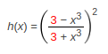
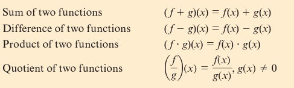
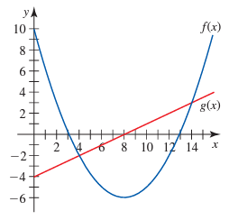
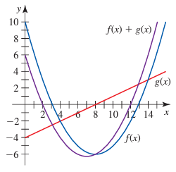
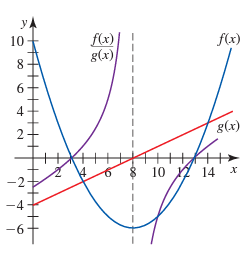

# Module 4

# General Notes

- **Exact form** is the form in which the equation is simplified as much as possible. 
  - For things like function composition, this means that the function is simplified to a single function.

## Example Decomposition

Given the functions:

Decomposition (there are multiple answers):

> **x3, (3 - g&frasl;3 + g)2**

# Combining Functions Symbolically

In example, given the functions:

> - <u>**Men's Life Expectancy</u>: M(t) = 0.204t + 70.0**
> - <u>**Women's Life Expectancy</u>: F(t) = 0.106t + 77.6**

To create a function that models the difference between men and women called *
*D(t)**:

1. Write out the symbolic expression for the difference between the two
   functions:

   > **D(t) = F(t) - M(t)**

2. Substitute the symbolic expressions for each function:

   > **D(t) = (0.106t + 77.6) - (0.204t + 70.0)**

3. Simplify the expression:

   > 1. **D(t) = 0.106t + 77.6 - 0.204t - 70.0**
   > 2. **D(t) = -0.098t + 7.6**

4. **Meaning:**
    - The difference in life expectancy between men and women is decreasing by
      0.098 years of age per year.
    - **Vertical Intercept:** 7.6
5. Confirm accuracy by substituting a value for **t** and comparing the results
   to the original functions.
6. The **theoretical domain** is all values except the value that would make the
   denominator zero.
    - In this case, the denominator is a constant, so the domain is all real
      numbers.
7. The **practical domain** refers to all values that make sense in the context
   of the problem.

# Combinations of Functions

## Example Combination of Functions One

Given the graph:

In order to graph the following combinations of functions:

1. **(f + g)(x)**
2. **(f&frasl;g)(x)**

### Graphing (f + g)(x)

The best thing to do is to create a table of the values for both functions and
then create another column with the modifications performed:

| x  | f(x) | g(x) | f(x) + g(x) |
|:--:|:----:|:----:|:-----------:|
| 0  |  10  |  -4  |      6      |
| 3  |  0   | -2.5 |    -2.5     |
| 4  |  -2  |  -2  |     -4      |
| 8  |  -6  |  0   |     -6      |
| 13 |  0   | 2.5  |     2.5     |
| 14 |  3   |  3   |      6      |

Then, plot the points:

### Graphing (f&frasl;g)(x)

Use the same strategy as before with the last column being the modifications:

| x  | f(x) | g(x) | f&frasl;g(x) |
|:--:|:----:|:----:|:----------------------------------:|
| 0  |  10  |  -4  |                -2.5                |
| 3  |  0   | -2.5 |                 0                  |
| 4  |  -2  |  -2  |                 1                  |
| 8  |  -6  |  0   |             undefined              |
| 13 |  0   | 2.5  |                 0                  |
| 14 |  3   |  3   |                 1                  |

Then, plot the points:

