# Module 5 - Percent Change and Radicals with Higher Order Radicals

<!-- TOC -->
* [Module 5 - Percent Change and Radicals with Higher Order Radicals](#module-5---percent-change-and-radicals-with-higher-order-radicals)
* [General Notes](#general-notes)
* [Radical Expressions With Higher Roots](#radical-expressions-with-higher-roots)
  * [Radical Simplification Example One](#radical-simplification-example-one)
  * [Radical Simplification Example Two](#radical-simplification-example-two)
* [Percent Change](#percent-change)
  * [Patterns of Growth](#patterns-of-growth)
  * [Exponential Functions](#exponential-functions)
    * [Exponential Function Definition](#exponential-function-definition)
  * [Finding Change Factors](#finding-change-factors)
    * [Visual Guide to Find Change Factors](#visual-guide-to-find-change-factors)
  * [Percentage Change Versus Change Factor](#percentage-change-versus-change-factor)
  * [Exponential Growth and Decay](#exponential-growth-and-decay)
<!-- TOC -->

# General Notes

# Radical Expressions With Higher Roots

When dealing with radicals, if you need to figure out what it is to a larger
degree, you can transform it by factoring it and then converting it to a
fractional power if needed.

---

## Radical Simplification Example One

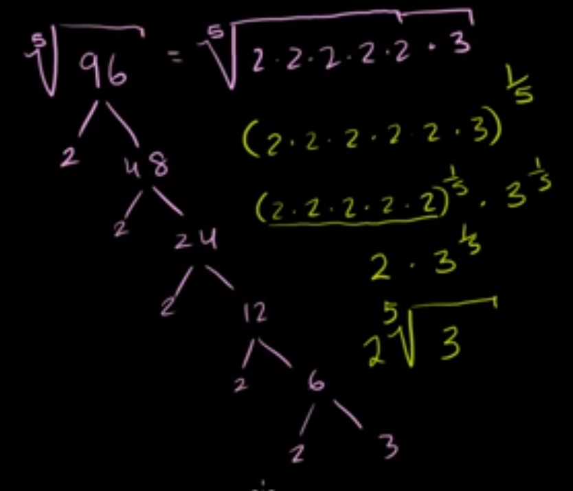

1. The radical was factored out
2. The factored-out radical was converted to a fractional power
3. The fractional power was simplified based on **2 &times; 31
   &frasl;3** going into the factored-out form **5** times,
   leaving **2 5&radic;
   3**

---

## Radical Simplification Example Two

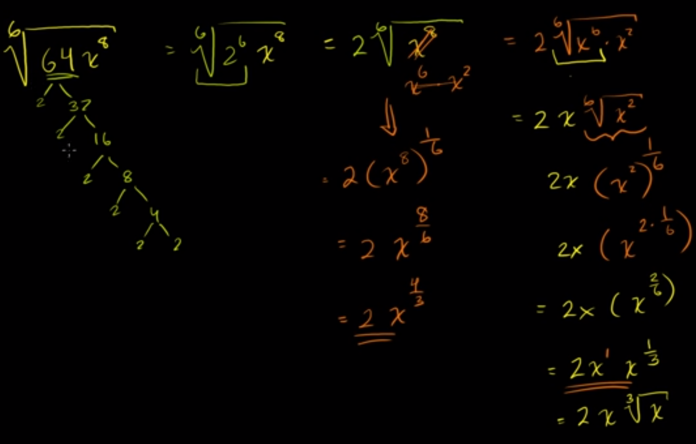

- Both of the answers are valid and equivalent

---

# Percent Change

## Patterns of Growth

> - The phrase _"is increasing at a rate of 100 people per month"_ describes
    growth using an average rate of change.
> - The phrase "is increasing at 0.019% per year"_ describes growth as a percent
    change.

- The first one is a **linear function** because it has a _constant rate of
  change_.
- The second is an **exponential function** because it has a _constant
  percentage rate of change_.

Given the table:

Here's the given information converted into a markdown table:

| Years Since 1971 | Number of  Transistors T | First Differences &Delta;T | Second Differences &Delta;(&Delta;T) |
|:------------------------:|:--------------------------------:|:----------------------------------:|:--------------------------------------------:|
|            0             |               2300               |                2300                |                     2300                     |
|            2             |               4600               |                4600                |                     4600                     |
|            4             |               9200               |                9200                |                     9200                     |
|            6             |              18,400              |               18,400               |                    18,400                    |
|            8             |              36,800              |               36,800               |                                              |
|            10            |              73,600              |                                    |                                              |

- Neither the **first differences** nor the **second differences** are constant,
  so the growth is <u>neither linear nor quadratic</u>.

The next step is to calculate the ratio (quotient) instead of the first and
second difference:

| Years Since 1971 x | Number of  Transistors Tx</sbu> | Ratio Tx+2&frasl;Tx | 
|:--------------------------:|:--------------------------------------------:|:-------------------------------------------------------------:|
|             0              |                     2300                     |      **4600&frasl;2300 &rarr; 2**       |
|             2              |                     4600                     |      **9200&frasl;4600 &rarr; 2**       |
|             4              |                     9200                     |     **18,400&frasl;9200 &rarr; 2**      |
|             6              |                    18,400                    |    **36,800&frasl;18,400 &rarr; 2**     |
|             8              |                    36,800                    |    **73,600&frasl;36,800 &rarr; 2**     |
|             10             |                    73,600                    |                                                               |

Assuming the same pattern continues, we can extrapolate the table further past
**10**

| Years Since 1971 x | Number of  Transistors Tx</sbu> | Ratio Tx+2&frasl;Tx |
|:--------------------------:|:--------------------------------------------:|:-------------------------------------------------------------:|
|             12             |                   147,200                    |   **294,400&frasl;147,200 &rarr; 2**    |
|             14             |                   294,400                    |   **588,800&frasl;294,400 &rarr; 2**    |
|             16             |                   588,800                    |                                                               |

## Exponential Functions

Using the table above, to interpolate, you need to create a function.
The following pattern can be found:

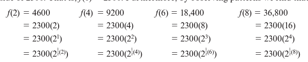

The function is: **&fnof;(x) = 2300(21&frasl;2
x)**

- **x** being the years after 1971.

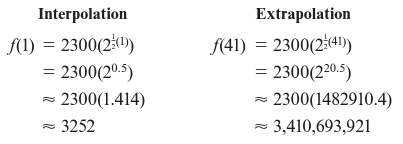

To create the exponential function:

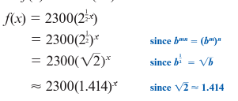

### Exponential Function Definition

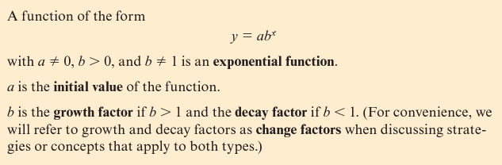

## Finding Change Factors

Given: **y = abx**

1. Calculate the ratio of the output values 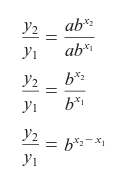
2. The rules of rational exponents state that **(xn)1
   &frasl;n = x**, so raise each side of the power of the
   inverse of the exponent, which is **1&frasl;x2 -
   x1** to solve for **b**: 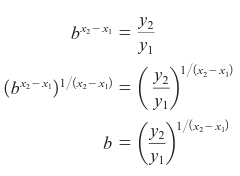
3. _Summarized:_ The change factor is the ratio of the outputs raised to **1**
   over the difference in the inputs.
4. Remember that:
    1. **b &times; b &times; b &times; b &times; b = b5**
    2. Assume **b5 = 1.236**
    3. **5&radic;b
       5 = 5&radic;
       1.236**
    4. **b = 1.043**

### Visual Guide to Find Change Factors

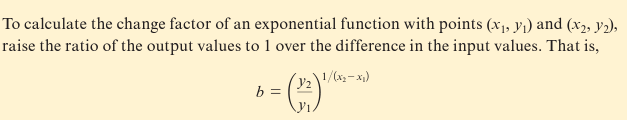

## Percentage Change Versus Change Factor

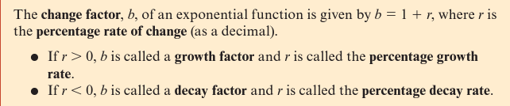

## Exponential Growth and Decay

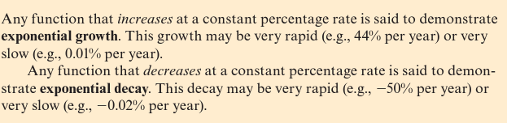

- **r** is used for **growth** and **decay** percentages.
