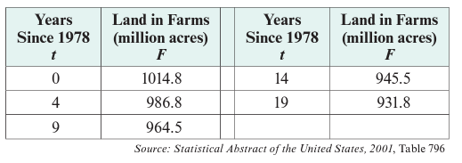
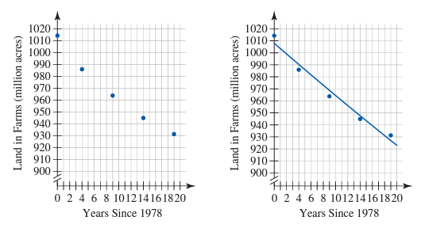
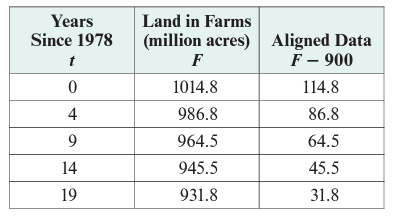

# Module 6 - Exponential Function Modeling and Graphs

<!-- TOC -->

* [Module 6 - Exponential Function Modeling and Graphs](#module-6---exponential-function-modeling-and-graphs)
* [General Notes](#general-notes)

<!-- TOC -->

# General Notes

# Modeling with Constant Percentage Rates of Change

- Anything that grows/decays by a constant percentage rate can be modeled by an
  exponential function.
- A reference to a percentage of growth in a verbal description often signals
  underlying exponential behavior.

## Creating an Exponential Model from a Verbal Description

> _"According to the World Health Organization, 538 thousand ITNs were
distributed in the African region in 1999. In 2003, 9485 thousand nets were
distributed. Between 1999 and 2003, net distribution increased at a nearly
constant percentage rate. Assuming net distribution will increase at a constant
percentage rate, find the function that models the distribution and explain
whether or not the estimate is realistic."_

1. Setting variables:
    - Let **_t_** represent the number of years since 1999. Let
    - Let **_n_** represent the number of nets distributed (in thousands).
2. Create a table of values for a better visual representation:
    - | **_t_** | **_n_** |
                       |:-------:|:-------:|
      | 0       | 538     |
      | 4       | 9485    |
3. Use the initial value as part of the exponential formula:
    **_n_(_t_) = 538(b)4**
4. Substitute the second point into the formula to find the base:
    1. **9485 = 538(b)4**
    2. **9485&frasl;538 = b4**
    3. **17.63 = b4**
    4. **(17.63)1&frasl;4 = (b
       4)1&frasl;4**
    5. **2.049 = b**
5. Substitute the base into the formula for the final exponential model:
    **_n_(_t_) = 538(2.049)_t_**
6. **Explanation:** The model gives a good estimate for the number of nets
   distributed in the African region between 1999 and 2003, but the further the
   model is extended, the less realistic the estimate becomes.
    - Exponential growth cannot continue indefinitely.

## Comparing a Rate of Change to a Percentage Change Rate

> _"The Netto Extra Treated Net was launched by Netto Manufacturing Co., Ltd.,
in April 2005 to meet the high demand for insecticide treated nets. According to
a certificate of analysis issued with the net, the initial deltamethrin (
insecticide) content in the net is 50.40 milligrams per square meter. After six
washes, the deltamethrin residue was measured to be 34.72 milligrams per square
meter. (Source: <www.nettogroup.com>) Calculate the average rate of change and
percentage rate of change. Which one more accurately represents this
situation?"_

1. The average rate of change formula can be used to get the average rate of
   change:
    
    - On average, the deltamethrin content decreases by 2.48 milligrams per
      square meter per wash.
2. Now to determine the percentage change, first determine the decay factor:
    
3. Now to determine the percentage rate of change:
    **0.9398 - 1 = &minus;0.0602**
4. **Explanation:** We expect that as the quantity of deltamethrin residue
   available in the net decreases, the amount that is removed in each subsequent
   wash will also decrease. For this reason, the percentage rate of change seems
   to more accurately represent what is going on in this situation.

# Modeling Half-Life and Doubling Time

- **Half-life:** The amount of time it takes for half of the initial amount of
  the substance to remain.
- **Doubling time:** The amount of time it takes for something that is growing
  to double.

## Half-Life Example

> _"Polonium-210 has a half-life of 138.376 days. What percentage of the
substance decays each day?"_

1. The remaining amount can be modeled by **y = ab1**
2. Substitute the intial value into the exponent
   since that's how many days it takes to halve:
    
3. **b = 1 + r &rarr; r = -0.005**
4. **Explanation:** The amount of polonium-210 remaining is decreasing at a rate
   of **0.5% per day**.

## Doubling Time Example

> _"The median price of a home in the United States was about $250,000 in 
> March 2007. (Source: <www.zillow.com>) At what annual percentage rate would 
> property values have to increase for the median price to double by 
> March 2017?"_

### Doubling Time Solution

- Because we assume constant percentage growth, an exponential function can be
  used to model the situation.

- **Explanation:** A doubling time of **10 years** corresponds with an annual
  percentage rate of about **7.2%**.
- **b** can be replaced with **1 + r** since **r** is the annual percentage rate
  and we're using percentage change rather than change factor.

## Determining if Data Can Be Represented by an Exponential Model

| Years Since 2000 | Average Brand-Name Drug Price (dollars) | Ratio of Consecutive Output Values |
|:------------------------:|:-----------------------------------------------:|:--------------------------------------:|
|            0             |                      65.29                      |               1.06831061               |
|            1             |                     169.75                      |               1.11096774               |
|            2             |                     277.49                      |               1.10427152               |
|            3             |                     385.57                      |               1.12025242               |
|            4             |                     495.86                      |                   -                    |

- The third column must be created by you and is created to determine if the
  data set has a constant or nearly constant percentage rate of change.
    - If it does, model the data set with an exponential function.
    - If it doesn't, model the data set with a different function.
- The ratios are all approximately equal to **1.1**, so the data set has a constant
  percentage rate of change.
- The following exponential function can be used to model the data set:
   **_p_(_t_) = 65.29(1.1)_t_ dollars**

# Using Regression to Find an Exponential Model

1. Enter the data table into a graphing calculator or Desmos
2. Use the regression formula to find the exponential model and enable _log
   mode_:
    **_y1_~_ab__x1_**
3. Function created based on table above:
    **p(6) = 64.25(1.102)_t_ dollars**
4. THe coefficient of determination, **_r2_**, is a measure of how
   well the model fits the data.
    - The closer **_r2_** is to 1, the better the model fits the
      data.
    - The closer **_r2_** is to 0, the worse the model fits the data.

# Graphing Exponential Functions

The growth factor plays a significant role in determining the shape of the graph
of an exponential function.

An example graph showing how much the graph changed based on the change factor:

## The Graphical Significance of the Change Factor

The change factor, **_b_**, controls the steepness and increasing/decreasing
behavior of the exponential function **_y = abx_**. For positive 
**_a_**,

- If **b > 1**, the graph is increasing, and increasing the value of **_b_**
  will make the graph increase more rapidly.
- if **0 < b < 1**, the graph is decreasing, and decreasing the value of **_b_**
  will make the graph decrease more rapidly.

Graph showing how the graph changes based on the change factor:

- The **vertical intercepts** correspond with the initial values of the
  exponential functions.

### Graphical Meaning of the Initial Value

The exponential function **_y = abx_** has a vertical intercept
**(0, _a_)**, where **_a_** is the initial value of the function.

# Asymptotes

- All exponential functions have a horizontal asymptote at the horizontal axis.

# Using Exponential Regression to Model an Aligned Data Set

Given the table of data showing the amount of land in farms in the United States
between 1978 and 1997:

After using exponential regression to find the exponential model, it doesn't fit
the data very well:

- The coefficient of determination, **_r2_**, is 0.976, which is
  relatively close to 1, but the graph doesn't fit the data very well.
- The reason is because it assumes that the horizontal asymptote is at **y = 0**
  like it is for most exponential functions.
    - Visually, we can see that it is at **y = 900**.

In order to fix this, you need to create an aligned set of data by subtracting
the horizontal asymptote from each output value _(which is **900**)_:

- Graph it again using the aligned data as the dependent variables (y-values).

The changed graph:

- <u>Don't forget to vertically shift the graph back up by adding the horizontal
  asymptote back to the function:</u>
   **L(t) = 115.1(0.9352)t + 900**

# Technological Tip

