# Module 7 - Solving Exponential and Logarithmic Functions

<!-- TOC -->
* [Module 7 - Solving Exponential and Logarithmic Functions](#module-7---solving-exponential-and-logarithmic-functions)
* [General Notes](#general-notes)
  * [Change of Base Formula Video](#change-of-base-formula-video)
* [Logarithms](#logarithms)
* [Logarithmic Functions](#logarithmic-functions)
  * [Properties of Exponents](#properties-of-exponents)
  * [Examples of Logarithmic Functions](#examples-of-logarithmic-functions)
* [Rules of Logarithms](#rules-of-logarithms)
  * [More Examples of Logarithmic Functions](#more-examples-of-logarithmic-functions)
    * [Logarithmic Function 1](#logarithmic-function-1)
    * [Logarithmic Function 2](#logarithmic-function-2)
  * [Generalized Rules for Logarithmic Functions](#generalized-rules-for-logarithmic-functions)
    * [Logarithm Rule One](#logarithm-rule-one)
      * [Examples for Rule One](#examples-for-rule-one)
    * [Logarithm Rule Two](#logarithm-rule-two)
    * [Logarithm Rule Three](#logarithm-rule-three)
      * [Examples for Rule Three](#examples-for-rule-three)
    * [Logarithm Rule Four](#logarithm-rule-four)
      * [Examples for Rule Four](#examples-for-rule-four)
    * [Logarithm Rule Five](#logarithm-rule-five)
      * [Examples for Rule Five](#examples-for-rule-five)
    * [All Rules of Logarithms](#all-rules-of-logarithms)
* [Solving an Exponential Equation Using Logarithms](#solving-an-exponential-equation-using-logarithms)
* [Common and Natural Logarithms](#common-and-natural-logarithms)
  * [Change of Base Formula](#change-of-base-formula)
* [Solving an Exponential Equation](#solving-an-exponential-equation)
* [Common Errors with Logarithms](#common-errors-with-logarithms)
<!-- TOC -->

# General Notes

## Change of Base Formula Video

[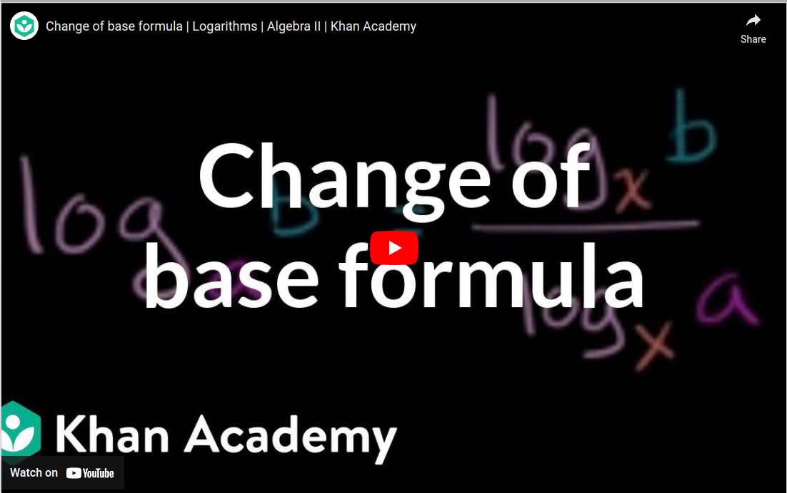](https://www.youtube.com/watch?v=OkFdDqW9xxM)

# Logarithms

Given the table and matching graph:

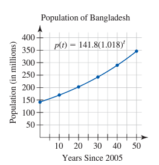

| Years Since 2005 t | Population (in millions) p(t) |
|----------------------------|---------------------------------------|
| 0                          | 141.8                                 |
| 10                         | 169.5                                 |
| 20                         | 202.6                                 |
| 30                         | 242.2                                 |
| 40                         | 289.5                                 |
| 50                         | 346.0                                 |

Assuming you want to find the year that the population will equal 250 million,
you need to find the inverse of the exponential function
that models the above table: **p(t) = 141.8(1.018)t**.

If you have a table, one method is to flip the values _(if you don't want to
solve algebraically)_:

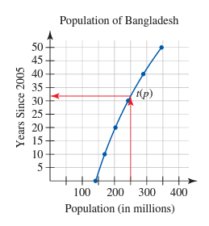

| Population (in millions) p(t) | Years Since 2005 t |
|---------------------------------------|----------------------------|
| 141.8                                 | 0                          |
| 169.5                                 | 10                         |
| 202.6                                 | 20                         |
| 242.2                                 | 30                         |
| 289.5                                 | 40                         |
| 346.0                                 | 50                         |

You can then visually identify when the population will be 250 million, but it
is best to algebraically solve for the inverse function:

1. **p(t) = 141.8(1.018)t**
2. **250 = 141.8(1.018)t**
3. **250&frasl;141.8 = (1.018)t**
4. **1.763 = (1.018)t**
5. Convert to logarithm:
    1. **t** is the exponent that goes on **1.018** to get to 1.763
    2. Using this logic, **t = log1.018(1.763)**
6. This is read as **"t equals log base 1.018 of 1.763"**
7. **t &approx; 31.785**
8. **1.01831.785 &approx; 1.763**

# Logarithmic Functions

- **log** is short for **logarithm**
- **y = logb(x)**
    - Ways to think of it:
        - **_"y equals log base b of x"_**
        - **_"y is the exponent we place on b to get x"_**
        - **_"What exponent on b is necessary to get x?"_**
        - **y** is the number that makes the equation **by = x**
          true.

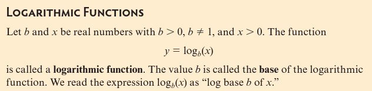

- A logarithmic function is the inverse of an exponential function
    - So if **x** is the independent variable and **y** is the dependent
      variable for a _**logarithmic function**_, then **y** is the independent
      variable and **x** is the dependent variable for the
      _**exponential function**_.

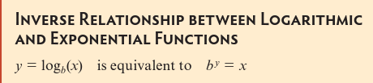

## Properties of Exponents

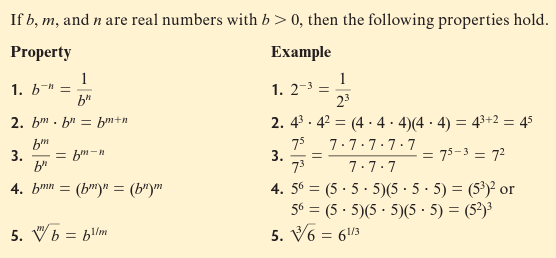

## Examples of Logarithmic Functions

1. Given **y = log3(81)** &rarr; **y = 4** because **34 =
   81**
2. Given **y = log4(5)** &rarr; **y is between 2 and 3** because
   **42 = 16** and **43 = 64**

# Rules of Logarithms

1. **Logarithms are exponents**
    - The rules of logarithms come from the properties of exponents
2. **Any number may be written as an exponential of any base**
    - Consider that both **34** and **92** equal 81
        - Either number may be substituted in any equation or formula that
          contains the number **81**.

## More Examples of Logarithmic Functions

### Logarithmic Function 1

Given **y = log3(81)** &rarr; **y = 4** because
**34 = 81**

Another way to write this is: **y = log3(34)**

- Now the question is **"What exponent on 3 is necessary to get
  34?"**, which is the obvious answer of **4**.

### Logarithmic Function 2

Given **y = log9(81)** &rarr; **y = 2**
because **92 = 81**

Another way to write this is: **y = log9(92)**

- Now the question is **"What exponent on 9 is necessary to get
  92?"**, which is the obvious answer of **2**.

## Generalized Rules for Logarithmic Functions

### Logarithm Rule One

> **logb(bm) = m**

From rule one, there are two things that are true:

1. **logb1 = 0**
2. **logbb = 1**

Because **b0 = 1** when **b > 0** and **b1 = b** for all
values:

- **logb(bm) = m**
- **logb(b0) = 0**
- **logb(1) = 0**

#### Examples for Rule One

Given:

1. **y = log100(0.01)**
    1. **= log100(1&frasl;100)**
        - Since **0.01 = 1&frasl;100**
    2. **= log100(100-1)**
        - Since **1&frasl;xn = x
          &minus;n**
    3. **= -1**
        - Log Rule 1
2. **y = log2(0.25)**
    1. **= log2(1&frasl;4)**
        - Since **0.25 = 1&frasl;4**
    2. **= log2(1&frasl;22)**
        - Since **4 = 22**
    3. **= log2(2-2)**
        - Since **1&frasl;xn = x
          &minus;n**
    4. **= -2**
        - Log Rule 1

### Logarithm Rule Two

> **blogb(m) = m**

- **by = m**
- **blogb(m) = m**    _&larr; since y = logb(
  m)_

### Logarithm Rule Three

> **logb(mn) = logb(m) + logb(n)**

#### Examples for Rule Three

Given:

1. **y = log2(16 * 64)**  _&larr; Method 1_
    1. **= log2(1024)**   _&larr; Multiply 16 * 24_
    2. **= log2(210)**   _&larr; Substitute 210
       for 1024._
    3. **= 10**   _&larr; Log Rule 1_
2. **y = log2(16 * 64)**    &larr; Method 2
    1. **= log2(24 * 26)**   _&larr; Substitute
       24 for 16 and 26 for 64_
    2. **= log2(24 + 6)**   _&larr; Exponent property 2:
       **xa * xb = xa + b**_
    3. **= 4 + 6**   _&larr; Log Rule 1_

Before adding the numbers, consider where the numbers **4** and **6** came from:

1. **4** came from **24 = 16** &rarr; so, **4 = log2(16)**
2. **6** came from **26 = 64** &rarr; so, **6 = log2(64)**
3. In other words: **log2(16 * 64) = log2(16) +
   log2(64)** &rarr; **6 + 4 = 10**

To generalize this:

1. **y = logb(m * n)**
2. **by = m * n**    &larr; _Relationship between logs and
   exponentials_
3. **by = (blogbm)(blogb
   n)**    &larr; _Log Rule 2_
4. **by = (blogbm + logbn)**
   &larr; _Exponent
   Property: **xa * xb = xa + b**_
5. **y = logb(m) + logb(n)**    &larr; _Equal exponentials
   with same bases have equal exponents._

### Logarithm Rule Four

> **logb(m&frasl;n) = logb(m)
&minus; logb(n)**

#### Examples for Rule Four

Given:

> **y = log2(64&frasl;16)**

- Although you could divide them, it is easier to rewrite them as exponents.

To solve:

1. **y = log2(64&frasl;16)**
2. **=
   log2(26&frasl;24)**
3. **= log2(26 * 2&minus;4)**
4. **= log2(26) + log2(2&minus; 4)**
   &larr; _Log Rule 3_
5. **= log2(26) + (&minus;4)**    &larr; _Log Rule 1_
6. **= log2(26) &minus; (4)**
7. **= log2(26) - log2(24)**
   &larr; _Log Rule 1_

The important part to remember is that:

> **log2(26&frasl;24)**
> is equal to **log2(26) &minus; log2(2
4)**

### Logarithm Rule Five

> **logb(mn) = n logb(m)**

#### Examples for Rule Five

Given:

> **log3(85)**

1. **log3(85)** &rarr; **log3(8 * 8 * 8 * 8 *
   8)**
2. **log3(8) + log3(8) + log3(8) + log
   3(8) + log3(8)** &larr; _Log Rule 3_
3. **5 log3(8)** &larr; _There are **5 log38** terms_

### All Rules of Logarithms

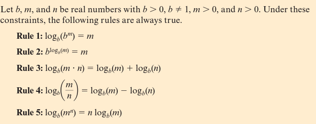

# Solving an Exponential Equation Using Logarithms

The problem:

> _"The total annual health-related costs in the United States in billions of
> dollars may be modeled by the function **H(t) = 30.917(1.1013)t**,
> where t is the number of years since 1960. (Source: Statistical Abstract of
> the United States, 2007, Table 120) According to the model, when will
> health-related costs in the United States reach 250 billion dollars?"_

The solution:

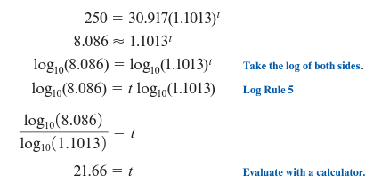

# Common and Natural Logarithms

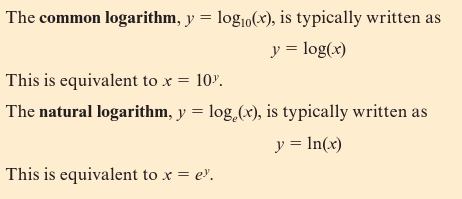

## Change of Base Formula

It is also possible to change the _base_ of any logarithm to make it a common or
natural logarithm:

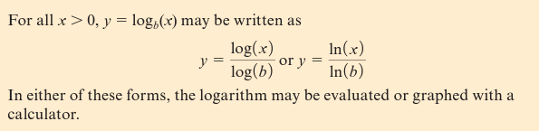

# Solving an Exponential Equation

The problem:

> _"The populations of India, I, and China, C (in thousands), can be modeled
using the functions **I(t) = 1,103,371(1.015)t**
and **C(t) = 1,323,345(1.007)t**, where t is in years since 2005.
According to these models, when will the populations of the two countries be
equal?"_

The solution:

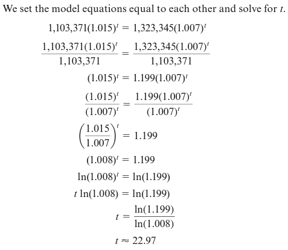

# Common Errors with Logarithms

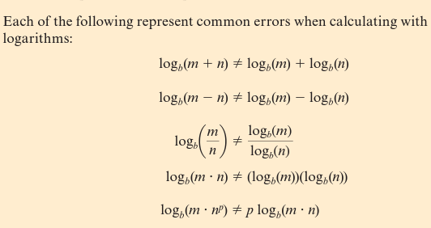