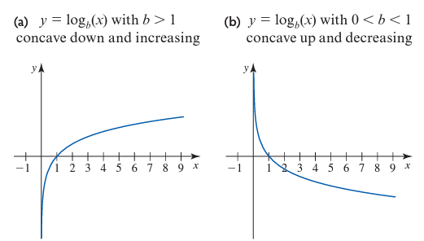
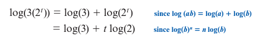
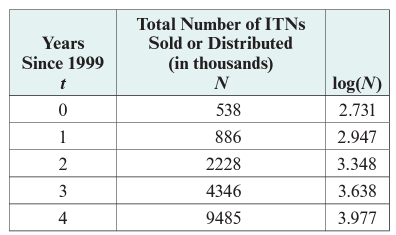
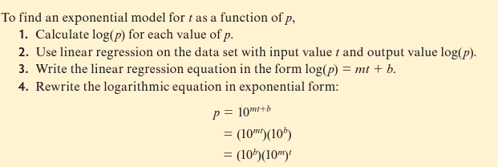

# Module 8 - Logarithmic Function Modeling

<!-- TOC -->
* [Module 8 - Logarithmic Function Modeling](#module-8---logarithmic-function-modeling)
* [Graphing Logarithmic Functions](#graphing-logarithmic-functions)
  * [Using Regression to Find a Logarithmic Model for a Data Set](#using-regression-to-find-a-logarithmic-model-for-a-data-set)
* [Finding an exponential Model Using Logarithms](#finding-an-exponential-model-using-logarithms)
  * [Using Logarithms to Linearize data](#using-logarithms-to-linearize-data)
  * [Finding an exponential Model from a Linearized data Set](#finding-an-exponential-model-from-a-linearized-data-set)
* [Logarithmic Regression Formula](#logarithmic-regression-formula)
<!-- TOC -->

# Graphing Logarithmic Functions

Given:

> **s(t) = 1872.6(1.0497)t**

To solve for **t**:

1. 
2. 

Explanation for step 2:

<u>Finding The Inverse of an Exponential Function:</u>

<u>Graph of the Above Function:</u>

- You can determine if a logarithmic function is appropriate for a scatter plot by looking to see if there is a vertical asymptote at the vertical axis.
  - The base of the logarithm is what determines the shape of the graph, but does not affect the vertical asymptote.

## Using Regression to Find a Logarithmic Model for a Data Set

Given the info:

- The function is increasing and concave down with a vertical asymptote at **x = 0**. This is the shape of a logarithmic function.

After plugging in the logarithmic regression formula of **y1 ~ a + b ln(x1)** into Desmos:

> **P(c) = -3.237 + 1.666 ln(c)**

# Finding an exponential Model Using Logarithms

## Using Logarithms to Linearize data

- An exponential data set is characterized by a constant ratio for equally spaced values.
  - Another way to check is to take the logarithm of the output values.

- This is a linear function due to the constant rate of change.

To convert the logarithmic function to linear:

- **log(3) &approx; 0.4771**
- **log(2) &approx; 0.3010**
- Final equation: **y &approx; 0.3010t + 0.4771**

To double-check results, plug in the function into the previous table:

## Finding an exponential Model from a Linearized data Set

- This is another method of finding an exponential model from a data set.

After calculating **log(N)** for each output value:

- After using linear regression on the data in **t** and **log(N)**:
   **log(N) = 0.3183t + 2.692**

To convert **log(N) = 0.3183t + 2.692** to an exponential form:

A Generalized example of how to find an exponential model using logarithms:

# Logarithmic Regression Formula

> **y1 ~ a + b ln(x1)**