# Module 9 - Logistic Functions

<!-- TOC -->
* [Module 9 - Logistic Functions](#module-9---logistic-functions)
* [General Notes](#general-notes)
* [Exponential Growth with Constraints](#exponential-growth-with-constraints)
* [Logistic Growth](#logistic-growth)
  * [Definition: Logistic Function](#definition-logistic-function)
    * [Graphing Logistical Functions in Desmos](#graphing-logistical-functions-in-desmos)
      * [Option One (Recommended for this course)](#option-one-recommended-for-this-course)
      * [Option Two](#option-two)
  * [Exploring Logistic Functions in a Real-world context](#exploring-logistic-functions-in-a-real-world-context)
* [Logistic Decay](#logistic-decay)
  * [Recognizing a Logistic Decay Function](#recognizing-a-logistic-decay-function)
  * [Using Logistic Regression to Model Data](#using-logistic-regression-to-model-data)
* [Finding The Inflection Point](#finding-the-inflection-point)
  * [To Find The X Coordinate](#to-find-the-x-coordinate)
  * [To Find The Y Coordinate](#to-find-the-y-coordinate)
<!-- TOC -->

# General Notes

# Exponential Growth with Constraints

- Exponential growth may seem slow at first but becomes very rapid.
    - _I.g. A population of 10,000 growing **2%** annually will double three
      times in 105 years._
- Exponential growth cannot continue forever and factors will always limit the
  growth.

# Graphing Logistical Functions in Desmos

## Option One (Recommended for this course)

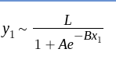

- **x:** This is the input to the function. 
  - Depending on the context, this could represent time, a certain measurement, or any other independent variable. 
- **L:** This is the maximum value the function can have, also known as the carrying capacity. 
  - In the context of population growth, this would represent the maximum population size that the environment can sustain.
- **a:** This variable is related to the initial value of the function. 
  - Specifically, when **x=0**, the function evaluates to **L&frasl;1 + a**
- **b:** This variable determines the steepness of the curve. 
  - Larger values of b result in a steeper growth curve. 
- **e:** This is the base of the natural logarithm, a mathematical constant approximately equal to **2.71828**. 
  - It's used in the exponential part of the function to create the characteristic "S" shape of the logistic curve.

## Option Two

> 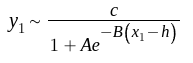

- **x**: This is the input to the function.
    - In many contexts, this represents time.
- **c**: This is the maximum value the function can have, also known as the
  carrying capacity.
    - In the context of population growth, this would represent the maximum
      population size that the environment can sustain.
- **a**: This variable is related to the value of the function at **x = 0**.
    - Specifically, when **x = 0**, the function evaluates to **c
      &frasl;1 + a**.
- **b**: This variable determines the steepness of the curve.
    - Larger values of bbb result in a steeper growth curve.
- **h**: This is the **x**-value of the function's point of maximum growth, also
  known as the inflection point.
    - This is the point at which the growth rate of
      the function is highest.
- **e**: This is the base of the natural logarithm, a mathematical constant
  approximately equal to **2.71828**.
    - It's used in the exponential part of the function to create the
      characteristic **"S"** shape of the logistic curve.

# Logistic Growth

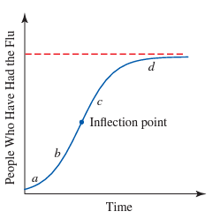

- **a:** Very slow exponential Growth
- **b:** Rapid exponential growth
- **c:** Slower increase
- **d:** Leveling off
- **Inflection point:** When the rate of change is at its maximum.
- **Red dashed line:** Horizontal asymptote
    - Represents the **limiting value** of the function.
- The mathematical model for such behavior is called a **logistic function**.

## Definition: Logistic Function

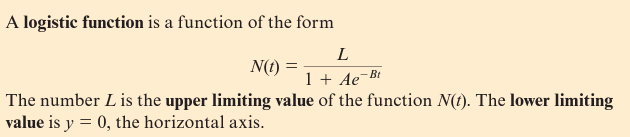

## Exploring Logistic Functions in a Real-world context

- Logistic functions are better than exponential functions at modeling data <u>
  when the graph fits the shape</u> because they will grow slowly &rarr; rapidly
  &rarr; levels off. An **exponential model** will increase slowly &rarr;
  increase at an ever-increasing rate &rarr; Exceed the **limiting value**.

# Logistic Decay

- Real-world models are often modeled with decreasing rather than increasing
  logistic functions.
- Logistic decay functions have:
    - **Upper Limiting Value: L**
    - **Lower-Limiting Value: y = 0**

## Recognizing a Logistic Decay Function

Given the table:

Apologies for the confusion. Here's the corrected table in markdown format:

| Years (Since 1950) **y** | Infant Mortality Rate (Deaths per 1000 live births) **M** |
|:--------------------------------:|:---------------------------------------------------------------------:|
|                0                 |                                 29.2                                  |
|                10                |                                 26.0                                  |
|                20                |                                 20.0                                  |
|                30                |                                 12.6                                  |
|                35                |                                 10.6                                  |
|                40                |                                  9.2                                  |
|                45                |                                  7.6                                  |
|                50                |                                  6.4                                  |
|                59                |                                  6.9                                  |

After calculating the rate of change:

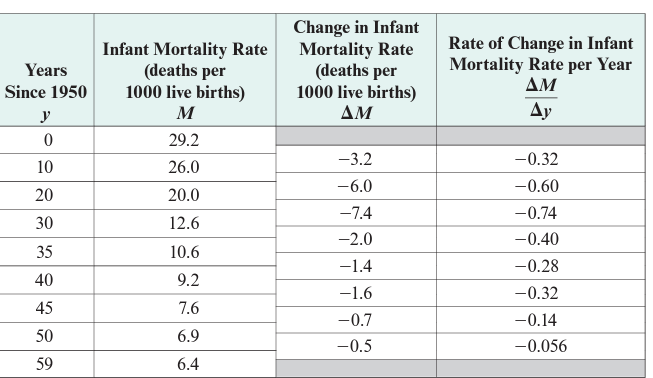

<u>Graph:</u>

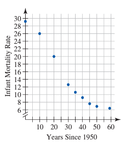

- The lower limiting value, based on the table and graph, is **6 deaths per 1000
  live births**.

## Using Logistic Regression to Model Data

- <u>**Important:** When a data set appears to be logistic but the **lower
  limiting value** is not **y = 0**, you need to align the data before using
  logistic regression to model the function.</u>

<u>Example:</u>

1. Using the above data, you first need to subtract the **lower-limiting value**
   before doing logistic regression.

   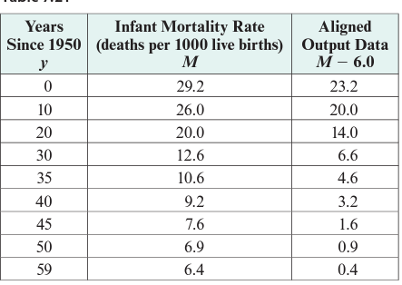

2. After using option 1 to perform logistic regression:
    - 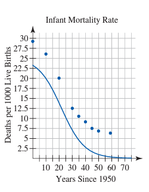
    - 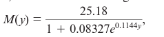
3. The line created is below the original values _(before aligning the data)_,
   so you need to add back the **lower-limiting value** to the function.
    - 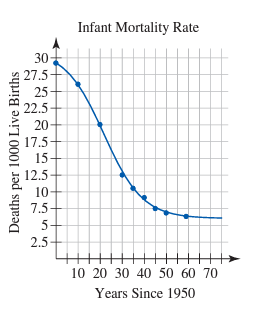
    - 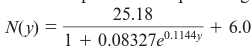

# Finding The Inflection Point

## To Find The X Coordinate

Set the logistic function equal to **c&frasl;2**:

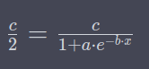

The simpler way to do it, if you have the numerical values, is to use:

> **a * e-b * x = 1**

Which further simplifies to:

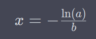

## To Find The Y Coordinate

> **y = c&frasl;2**

Then find the intersection on the graph. The **x** value is the **inflection

