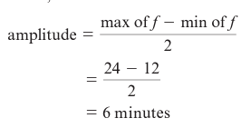
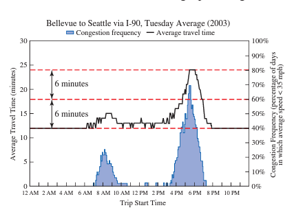
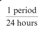
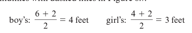

# Module 10 - Periodic Functions

<!-- TOC -->
* [Module 10 - Periodic Functions](#module-10---periodic-functions)
* [General Notes](#general-notes)
* [Periodic Functions](#periodic-functions)
  * [Example Explanation](#example-explanation)
* [Midline (Centerline)](#midline-centerline)
* [Amplitude](#amplitude)
* [Frequency](#frequency)
  * [Determining the Frequency of a Periodic Function](#determining-the-frequency-of-a-periodic-function)
* [Determining Periodic Behavior from Tabular Data](#determining-periodic-behavior-from-tabular-data)
* [Extrapolating Periodic Graphical Data](#extrapolating-periodic-graphical-data)
* [Extrapolating Periodic Tabular Data](#extrapolating-periodic-tabular-data)
  * [Base Table](#base-table)
  * [Extrapolated Data](#extrapolated-data)
* [Examples of Periodic vs Non-Periodic Graphs](#examples-of-periodic-vs-non-periodic-graphs)
  * [Periodic](#periodic)
  * [Non-Periodic](#non-periodic)
<!-- TOC -->

# General Notes

# Periodic Functions

A **periodic function** is a function whose output values repeat at regular intervals, or **periods**. 

- Such a function is said to have **periodicity**.

A function **&fnof;** is **periodic** if **&fnof;(x + p) = &fnof;(x)** for all **x** and for a positive constant **p**. 

- The value **p** is called the **period** of the function.
- Normally **p** would shift the graph horizontally, but with periodic functions, it does not.

<u>Important Terms:</u>

- **Midline (Centerline)**
- **Amplitude**
- **Frequency**

## Example Explanation

<u>Table:</u>

<u>Graph:</u>

<u>Explanation:</u>

- If we assumed that the travel times for Wednesday and Thursday were the same, then the function has a **period** of 24 hours.
  - _Every 24 hours, the travel-time pattern will repeat._

# Midline (Centerline)

- When working with periodic functions, we are often interested in the **midline** of the function.

The **midline** or **centerline** of a periodic function **&fnof;** is the horizontal line that lies halfway in between the maximum and minimum output values of the function. In other words, the midline is the horizontal line with equation

- Using the above graph, estimating the maximum travel time to be **24 minutes** and the minimum travel time to be **12 minutes**, the midline is:
   **y = 24 + 12&frasl;2 &rarr; 18 minutes**

The red-dashed line indicates the <u>midline</u>:

- Where the graph is above the midline indicates the travel time exceeds the average of the maximum and minimum travel times.
  - Occurs between **4:45 PM** and **7:00 PM**, indicated by black-dashed lines.

# Amplitude

- Another important characteristic of a periodic function is its **amplitude**.

The amplitude of a periodic function f is the distance from the midline to the maximum or minimum output value of the function. In symbolic terms,

> **amplitude = max of &fnof; - midline**

Equivalently, the amplitude is half of the distance between the maximum and minimum output values of the function:

For the travel-time function, the amplitude is:

<u>Explanation:</u>

- The _maximum_ commute time is 6 minutes _more_ than the average of the maximum and minimum travel times.
- The _minimum_ commute time is 6 minutes _less_ than the average of the maximum and minimum travel times.

Additional red-dashboard lines indicate the <u>amplitude</u>:

# Frequency

- The **frequency** of a periodic function is closely related to its period.

The frequency of a periodic function is the reciprocal of its period:

> **frequency = 1&frasl;period**

- The period of the travel-time function is 24 hours, so its frequency is:
   
  - For each hour that passes, the travel-time function moves through **1&frasl;24** of its period.
- A periodic function’s frequency is generally measured in the number of cycles (periods) per unit of time such as minutes, seconds, and so on.

- The **green** graph has the highest frequency
- The **black** graph has the lowest frequency

## Determining the Frequency of a Periodic Function

1. Find the **midline** by getting the average between the maximum and minimum values.
    
2. Find the **amplitude** by getting the difference between the maximum and minimum values divided by 2.
    
3. Find the **period** by getting the difference between the two points where the graph returns to its starting point.
    
   - The boy's period is **8 seconds**
   - The girl's period is **4 seconds**
4. Find the **frequency** by getting the reciprocal of the periods:
   - 
   - 
5. The girl's frequency _(0.25)_ is twice as large as the boy's frequency _(0.125)_, so the girl is traveling twice as fast as the boy.

# Determining Periodic Behavior from Tabular Data

Given the table:

- The table would be **perfectly periodic** if the houses sold in **2006** were the same as **2005** for the matching months.
  - Even if they were slightly off, it would still be considered **periodic**.
- This data does not appear to be periodic.
  - Sales in **2006** increased in the first three months.
  - Sales in **2006** decreased, then increased in the first three months.
  - There are more differences in the table that can be seen where one is decreasing and the other is increasing.

# Extrapolating Periodic Graphical Data

# Extrapolating Periodic Tabular Data

## Base Table

## Extrapolated Data

# Examples of Periodic vs Non-Periodic Graphs

## Periodic

## Non-Periodic

