# Module 11 - Angles

<!-- TOC -->
* [Module 11 - Angles](#module-11---angles)
* [General Notes](#general-notes)
  * [Explaining Why Angle Measure is Constant](#explaining-why-angle-measure-is-constant)
  * [Resources](#resources)
* [Angles](#angles)
  * [Proportionality](#proportionality)
  * [Relationship Between Arc Length and Radius](#relationship-between-arc-length-and-radius)
  * [Relating Radius and Arc Length](#relating-radius-and-arc-length)
  * [Determining When Arc Length Equals Radius](#determining-when-arc-length-equals-radius)
* [Measuring Angles Using Radians](#measuring-angles-using-radians)
  * [Radian Measure](#radian-measure)
  * [Determining the Number of Radians in One Revolution of the Unit Circle](#determining-the-number-of-radians-in-one-revolution-of-the-unit-circle)
  * [Arc Length as a Function of Angle Measure in Radians](#arc-length-as-a-function-of-angle-measure-in-radians)
  * [Determining The Radian Measure of an Angle](#determining-the-radian-measure-of-an-angle)
  * [Determining the Proportion of a Circumference That Corresponds with an Angle](#determining-the-proportion-of-a-circumference-that-corresponds-with-an-angle)
* [Sketching Angles](#sketching-angles)
  * [Radian Angle Graph One](#radian-angle-graph-one)
  * [Radian Angle Graph Two](#radian-angle-graph-two)
  * [Radian Angle Graph Three](#radian-angle-graph-three)
  * [Radian Angle Graph Four](#radian-angle-graph-four)
  * [Radian Angle Graph Five](#radian-angle-graph-five)
* [Angles That Measure Greater Than 2&pi; Radians](#angles-that-measure-greater-than-2pi-radians)
* [Measuring Angles Using Degrees](#measuring-angles-using-degrees)
  * [Degree Measure](#degree-measure)
  * [Sketching Angles Measured in Degrees](#sketching-angles-measured-in-degrees)
    * [Degree Angle Graph One](#degree-angle-graph-one)
    * [Degree Angle Graph Two](#degree-angle-graph-two)
    * [Degree Angle Graph Three](#degree-angle-graph-three)
    * [Degree Angle Graph Four](#degree-angle-graph-four)
    * [Degree Angle Graph Five](#degree-angle-graph-five)
  * [Arc Length as a Function of Angle Measure in Degrees](#arc-length-as-a-function-of-angle-measure-in-degrees)
* [Converting from Degree Measure to Radian Measure](#converting-from-degree-measure-to-radian-measure)
  * [Convert an Angle Measure From Degrees to Radians](#convert-an-angle-measure-from-degrees-to-radians)
* [Converting from Radian Measure to Degree Measure](#converting-from-radian-measure-to-degree-measure)
  * [Convert an Angle Measure From Radians to Degrees](#convert-an-angle-measure-from-radians-to-degrees)
<!-- TOC -->

# General Notes

- You can drop the units and assume things like **&theta; = 4** is in radians.

## Explaining Why Angle Measure is Constant

Within this angle in the unit circle, it does not matter in which location
the angle is measured, because the measure of the angle is the same due to:

> **&theta; =  k&hairsp;s&frasl;r**

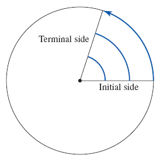

- **k** is the constant of measure that sets the outcome to the correct units, by multiplying it by either **1 for radians** or **180&frasl;2&pi;** for degrees.
- **s** is the arc length and changes at each point from where the angle is measured.
- **r** is the radius and changes at each point from where the angle is measured.
- The reason that the angle measure is constant is that the arc length and radius are changing at the same rate, so the ratio of the two is constant.

## Resources

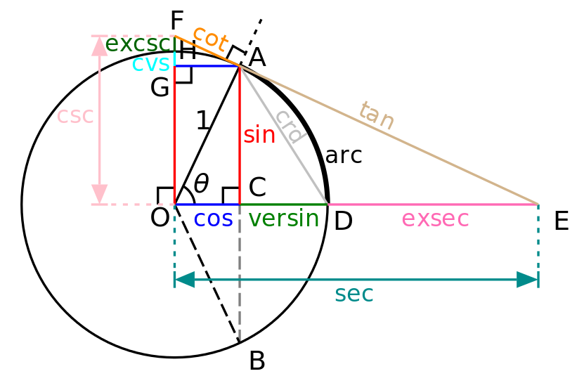

---

**PDF Resource:** [Angle Measure, Arch Length, Sector Area](assets/section_8.2_anglemeasure_arclength_sectorarea.pdf)

# Angles

- From a geometric point of view, an angle is the figure formed by two 
  **rays** (or **segments**) sharing a common endpoint.
    - The amount of opening between the two rays.

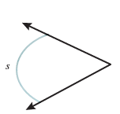

- Because **s** is a portion of the circumference of a circle, **C**, the length
  of the arc, **s**, can be found with some constant, **k**
   **Equation: s = kC**
    - **Circumference: C = 2&pi;_r_**

We have two equations now and will substitute one into the other:

> 1. **s = kC** | **C = 2&pi;_r_**
> 2. **s = k(2&pi;_r_)**
> 3. **s = (2&pi;k)r**
> - The parentheses moved because **2&pi;** and **k** are constants, turning **2&pi;k** into the new constant of proportionality.

The above shows that the arc length, **s**, is directly proportional to the
radius, **r**, of the circle with constant of proportionality, **2&pi;k**.

For simplicity, this can be represented as **K = 2&pi;k** &rarr; **s = Kr**

- This is all saying that <u>**k** is how much of the circumference of the
  circle.</u>

<u>Example One:</u>

Assume the arch length is half of the circumference of the circle, so
**k = 1&frasl;2**:

1. **s = (2&pi;k)r**
2. **s = (2&pi;1&frasl;2)r**
3. **s = &pi;r**

When the arc length is half of the circumference of the corresponding circle,
the arc length is equal to **&pi;** times the radius.

<u>Example Two:</u>

Assume the arc length is one-sixth of the circumference, so
**k = 1&frasl;6** :

1. **s = (2&pi;k)r**
2. **s = (2&pi;1&frasl;6)r**
3. **s = &pi;&frasl;3r**

When the arc length is one-sixth of the circumference of the corresponding
circle, the arc length is equal to **&pi;&frasl;3** times
the radius.

## Proportionality

A quantity y is said to be **directly proportional** to a quantity **x** if 
**y = kx** for some constant value **k**, called the **constant of
proportionality**. Consider the following examples.

1. .The circumference of a circle is directly proportional to its radius with a
   constant of proportionality **_2&pi;_**. That is, **_C = 2&pi;r_**.
2. The total cost of filling a gas tank is directly proportional to the number
   of gallons put in the tank. The constant of proportionality is the gasoline
   price per gallon. At a price of **$3.489 per gallon**, the cost is 
   **_C = 3.489x_**.

## Relationship Between Arc Length and Radius

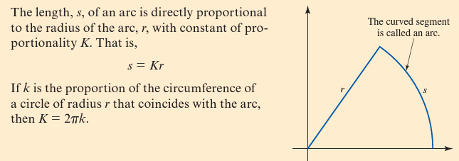

## Relating Radius and Arc Length

1. **Arc length = 2&frasl;3 circumference**
2. Constant of proportionality: **K = 2&pi;k** &rarr; **2&pi;(2
   &frasl;3)**
    - Because the arc length is **2&frasl;3** of the
      circumference, **k = 2&frasl;3**
3. **4&pi;&frasl;3&thinsp;r**
    - The equation for arc length as a function of radius, for an arc that is
      equal to **2&frasl;3** of the circumference of the
      circle.

## Determining When Arc Length Equals Radius

When **arc length = radius**, the equation **s = Kr** becomes **r = Kr**.

_Explanation:_

1. Solve for **K**
    1. **r = Kr**
    2. **r&frasl;r = K**
    3. **1 = K**
1. **K = 2&pi;k**
2. **1 = 2&pi;k**
3. **1&frasl;2&pi; = k**
4. **0.159 &approx; k**
5. **Meaning:** When the arc length is about **15.9%** of the circumference, the
   arc length and the corresponding radius are equal.

# Measuring Angles Using Radians

For angles, there are two different measurement systems commonly used:

1. **Degrees**
2. **Radians**
    - Has a close connection with arc length

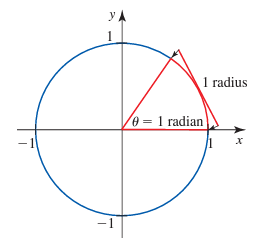

- **Unit circle:** A circle of radius 1 centered at the origin.
- 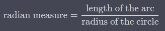
- If you take the radius length of a circle and lay it along the circumference,
  starting at **(1, 0)** as pictured, the angle that is formed with the center
  of the circle is **1 radian**.
- The measure of the angle &theta; that corresponds with an arc length of 1
  radius is 1 radian

## Radian Measure

The measure of an angle **&theta;** that corresponds with an arc length of 1
radius in the counterclockwise direction is 1 **radian**.

## Determining the Number of Radians in One Revolution of the Unit Circle

It takes **&approx; 6.28 radius lengths** to span the circumference of the
circle.

- The exact number of lengths is **2&pi; (2&pi; &approx; 6.2832)**.
- This is where the formula **C = 2&pi;r** comes from.

## Arc Length as a Function of Angle Measure in Radians

The length, **s**, of the arc corresponding with an angle measure of &theta;
radians
is:

> **s = &theta;r**

where **r** is the length of the radius. For the unit circle, **s = &theta;**:

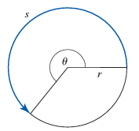

- Remember that the length, **s**, of an arc is directly proportional to the
  radius of the arc, **r**, with constant of proportionality **K**.
    - When measuring angles in radians, the constant of proportionality equals
      the
      angle measure, **K = &theta;**

## Determining The Radian Measure of an Angle

Determining the radian measure of an angle that corresponds with **1
&frasl;4** of **2&pi;**:

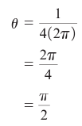

- The radius was not used because for any circle, **1&frasl;
  4** of the circumference corresponds with an angle measure of **
  &pi;&frasl;2**.
    - The measure of the angle is 
      **&pi;&frasl;2 radians.**

## Determining the Proportion of a Circumference That Corresponds with an Angle

In determining what proportion of a circle's circumference corresponds with an
angle of **4&pi;&frasl;3** radians:

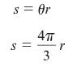

<u>Solution:</u>

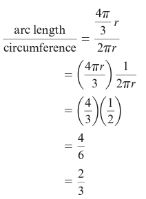

<u>Explanation:</u>

An angle of **4&pi;&frasl;3 radians** corresponds with 
**2&frasl;3** of the circumference of the circle.

# Sketching Angles

Angles have two sides:

1. **Initial side**
2. **Terminal side**

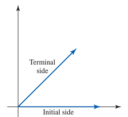

- **Positive angle:** Start on the positive horizontal axis and sweep out an arc
  counterclockwise.
- **Negative angle:** Start on the positive horizontal axis and sweep out an arc
  clockwise.

_The magnitude of the angle determines the position of the terminal side._

## Radian Angle Graph One

> **&theta; = &pi;**

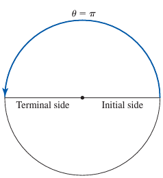

- **2&pi; = circumference**, and we only need half of that.

---

## Radian Angle Graph Two

> **&theta; = -&pi;**

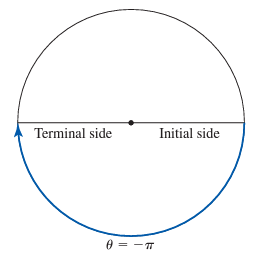

- This ones goes clockwise because it is negative.

---

## Radian Angle Graph Three

> **&theta; = &pi;&frasl;4**

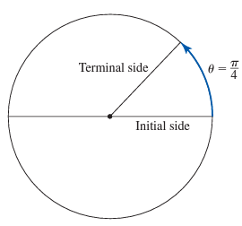

- **&theta; = &pi;&frasl;4** &rarr; **&theta; = 
  1&frasl;4&pi;**
- This angle is one-quarter of the angle **&theta; = &pi;**

---

## Radian Angle Graph Four

> **&theta; = &minus;&thinsp;2&pi;&frasl;3**

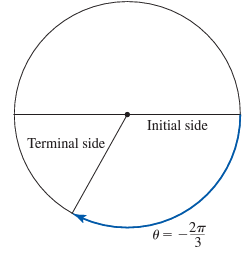

- **&theta; = &minus;&thinsp;2&pi;&frasl;3** &rarr;
  **&theta; = &minus;&thinsp;2&frasl;3&pi;**
    - This is two-thirds of the angle.
    - **&theta; = &pi;** and since it is negative, goes in a clockwise
      direction.

---

## Radian Angle Graph Five

> **&theta; = 4**

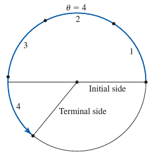

1. For the unit circle, the numeric value of the angle is equivalent to the arc
   length.
2. The angle and arc length are **4**.
3. 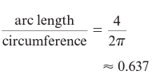
4. The terminal side of the angle will occur close to **2&frasl;
   3 _(66.7%)_** of the way around the circle, counterclockwise from the
   initial side.

---

# Angles That Measure Greater Than 2&pi; Radians

> **&theta; = 2.5&pi;**

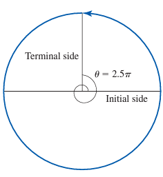

Converting to revolutions:

1. **&theta; = 2&pi; + 0.5&pi;**
2. **&theta; = 2&pi; + 1&frasl;2&pi;**
3. **&theta; = 2&pi; + 1&frasl;4(2&pi;)**
4. **&theta; = 1 revolution + 1&frasl;4 revolution**

# Measuring Angles Using Degrees

<u>History:</u>

- Due to ancient Babylonians, an angle whose arc length is **1
  &frasl;360** of the circumference of a circle is **1 degree** _(
  notated **1&deg;**)_.
- **360** was chosen because of its factors and how determining the angle
  measure for them results in a whole number.
    - _E.g. 2, 3, 4, 5, 6, 8, 9, 10_
    - _E.g. **1&frasl;10(360&deg;) = 36&deg;**_

## Degree Measure

The measure of an angle **&theta;** that corresponds with an arc length of 
**1&frasl;360** of the circumference of a circle is **1
degree**.

## Sketching Angles Measured in Degrees

Just **divide** the **degree** by **360** to get the fraction necessary.

### Degree Angle Graph One

> **&theta; = 180&deg;**

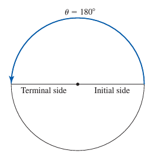

### Degree Angle Graph Two

> **&theta; = -180&deg;**

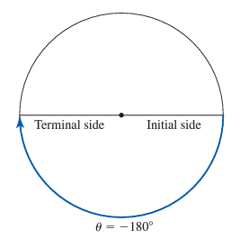

### Degree Angle Graph Three

> **&theta; = 120&deg;**

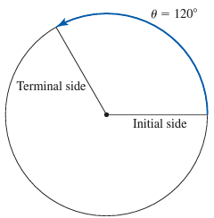

### Degree Angle Graph Four

> **&theta; = -225&deg;**

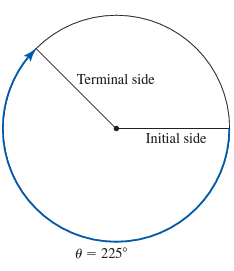

### Degree Angle Graph Five

> **&theta; = 72&deg;**

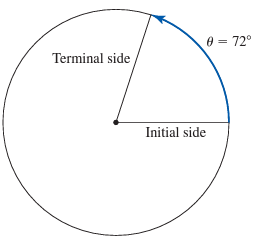

## Arc Length as a Function of Angle Measure in Degrees

Prior knowledge:

- **s = Kr**
- **K = 2&pi;k**
- **k = proportion of the circumference included in the arc length**

Which gave us:

> **s = (2&pi;k)r**

Because **&theta;** is an angle in degrees, **k = &theta;&frasl;
360**

Substituting into the above equation:

1. **s = (2&pi;k)r**
2. **s = (2&pi;(&theta;&frasl;360))r**
3. **s = (&pi;&frasl;180&thinsp;&theta;)r**

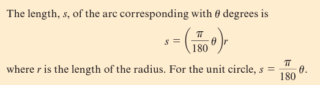

# Converting from Degree Measure to Radian Measure

> **360&deg; = 2&pi; radians**

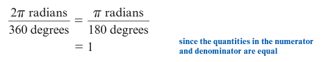

Example of converting **30&deg;** to radians:

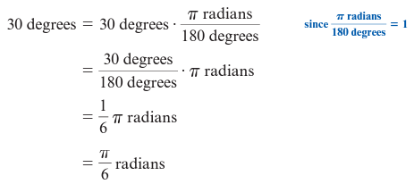

- **30&deg; = &pi;&frasl;6 radians**

## Convert an Angle Measure From Degrees to Radians

To convert degree measure to radian measure, multiply **&theta;** degrees by 
**&pi; radians&frasl;180 degrees**

# Converting from Radian Measure to Degree Measure

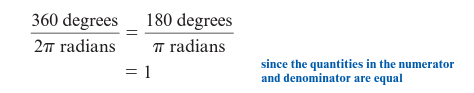

Example of converting **7&pi;&frasl;4** radians to
degrees:

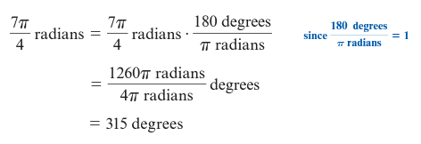

- **7&pi;&frasl;4 radians = 315&deg;**

## Convert an Angle Measure From Radians to Degrees

To convert radian measure to degree measure, multiply **&theta;** radians by 
**180 degrees&frasl;&pi; radians**
 
