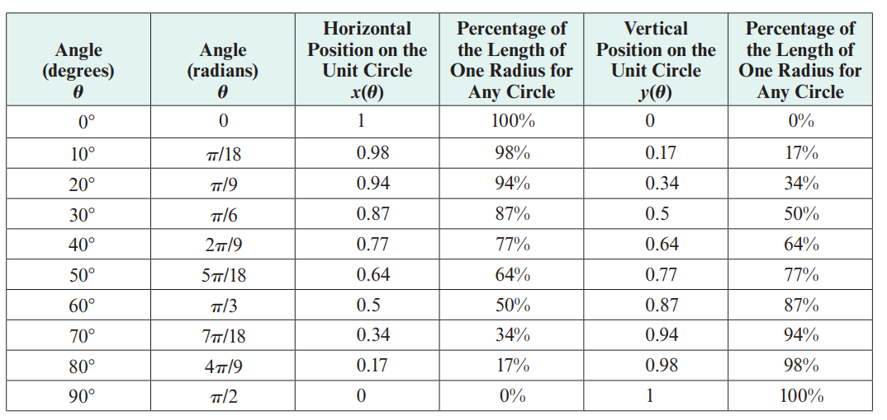
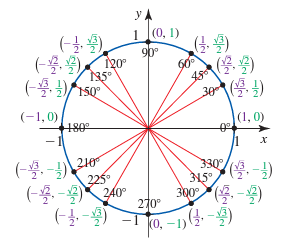

# Module 12 - Unit Circle and Trigonometric Functions

<!-- TOC -->
* [Module 12 - Unit Circle and Trigonometric Functions](#module-12---unit-circle-and-trigonometric-functions)
* [General Notes](#general-notes)
* [Defining The Circle](#defining-the-circle)
  * [Unit Circle](#unit-circle)
  * [Estimating **x(&theta;)** and **y(&theta;)**](#estimating-xtheta-and-ytheta)
    * [Estimation Example One](#estimation-example-one)
    * [Estimation Example Two](#estimation-example-two)
* [Circles With Radii Other Than 1](#circles-with-radii-other-than-1)
  * [Radii > 1 Example One](#radii--1-example-one)
* [Cosine and Sine Functions](#cosine-and-sine-functions)
  * [Cosine Function](#cosine-function)
  * [Sine Function](#sine-function)
  * [Using and Interpreting Cosine and Sine](#using-and-interpreting-cosine-and-sine)
    * [Evaluating Example One](#evaluating-example-one)
    * [Evaluating Example Two](#evaluating-example-two)
    * [Evaluating Example Three](#evaluating-example-three)
* [Domain and Range of the Cosine and Sine Functions](#domain-and-range-of-the-cosine-and-sine-functions)
  * [Domain](#domain)
  * [Range](#range)
* [Reference Angles](#reference-angles)
  * [Using Reference Angles](#using-reference-angles)
* [Exact Values of Cosine and Sine on the Unit Circle](#exact-values-of-cosine-and-sine-on-the-unit-circle)
  * [Standard Angles](#standard-angles)
  * [References](#references)
    * [Circle of Angles](#circle-of-angles)
    * [Table of Angles](#table-of-angles)
  * [Example Problems - Finding The Exact Values](#example-problems---finding-the-exact-values)
    * [Exact Values Problem One](#exact-values-problem-one)
    * [Exact Values Problem Two](#exact-values-problem-two)
<!-- TOC -->

# General Notes
  
# Defining The Circle

- Set of points that are all a fixed distance _(radius)_ away from a central point.

## Unit Circle

A circle with its center at **(0, 0)** and a radius of 1.

## Estimating **x(&theta;)** and **y(&theta;)**

### Estimation Example One

Estimating corresponding angles from **0&deg;** to **90&deg;**.

- You first create the graph going to 1 unit in both the horizontal and vertical directions, then start measuring the angle at the various degrees.

Next, you can fill out a table of the values:

- Endpoint of the arc is **45&deg;** because it is equidistant from both axes.

These ideas can be applied to arcs of any measure:

- Where the endpoint of the arc is determines negative or positive

### Estimation Example Two

The goal is to estimate the following:

Estimations:

# Circles With Radii Other Than 1

When the values are not from **-1 to 1** and are something like **-5 to 5**,
the values have grown by a factor of **5** and can be represented on a table
to better visualize it:

- This principle can be applied to a circle of any size.
- Use the unit circle and then multiply it by a factor of the original circle.

## Radii > 1 Example One

To find the endpoint of an arc corresponding with a **70&deg;** angle on a circle with a radius of 12 units:

# Cosine and Sine Functions

- Both **sin** and **cos** aren't written with units.
  - _They can be thought of as radius length though._

## Cosine Function

**cosine _(cos)_:** The horizontal position of the endpoint of the corresponding arc on the unit circle.

  - The cosine of an angle **&theta;**, denoted **cos(&theta;)**
  > - **x(&theta;) = r * cos(&theta;)** can be used to get the horizontal position of a point on the arc of a circle.
  >  - **r** is the radius
  >  - **&theta;** is the corresponding angle

## Sine Function

**sine _(sin)_:** The vertical position of the endpoint of the corresponding arc on the unit circle.

  - The sine of an angle **&theta;**, denoted **sin(&theta;)**
  > - **y(&theta;) = r * sin(&theta;)** can be used to get the vertical position of a point on the arc of a circle.
  >  - **r** is the radius
  >  - **&theta;** is the corresponding angle

## Using and Interpreting Cosine and Sine

### Evaluating Example One

> **cos(20&deg;)**

- **cos(20&deg;)** is the horizontal position of the endpoint of the arc corresponding to **20&deg;** on the unit circle.
  - **&approx; 0.94**

### Evaluating Example Two

> **4sin(10&deg;)**

- The circle has a radius larger than 1 since there is a constant multiplied
  by either cosine or sine.

1. **sin(20&deg;) &approx; 0.17**
2. **4sin(20&deg;) &approx; 0.69**

### Evaluating Example Three

> **(cos(40&deg;), sin(40&deg;))**

- **cos(40&deg;) &approx; 0.77**
- **sin(40&deg;) &approx; 0.64**

# Domain and Range of the Cosine and Sine Functions

## Domain

The domain of **cos(&theta;)** and **sin(&theta;)** is <u>**all real numbers**</u>.

- Anything over one full rotation will start a new rotation with the same
  numbers.

## Range

The range of **cos(&theta;)** and **sin(&theta;)** is <u>**-1 to 1**</u>.

- These two functions represent a point on the unit circle, which is a circle
  with a radius of 1.

# Reference Angles

The smallest positive angle formed by the terminal side of the angle **&theta;** and the x-axis.

- Every point **(x, y)** on the circle also has corresponding points at **(-x, y)**,  **(x, -y)**, and **(-x, -y)**. 
  - When the reference angles are equivalent, the x- and y-values of the points on the circle will have the same magnitudes, although the signs will differ depending on the quadrant in which the point is located.
- The reference point will always be between **0&deg;** and **90&deg;** _(**0
   and &pi;&frasl;2)**_.

- To find the reference angle, add or subtract the angle from either **180&deg; _(&pi;)_** or **360&deg;** _(**&pi;&frasl;2**)_.

## Using Reference Angles

# Exact Values of Cosine and Sine on the Unit Circle

- **Altitude:** A line drawn from a vertex perpendicular to the opposite side.

The pythagorean theorem can be used to find the length of the altitude: 

This means that:

- 
- 

_Always **rationalize** the denominator so that it contains no radicals._

## Standard Angles

The _standard angles_ used are:

- **30&deg;**
  - Uses an equilateral triangle along the altitude.
- **45&deg;**
  - Uses an isosceles right triangle along the altitude.
    - A triangle whose legs are equal length.
  - 
- **60&deg;**
  - Uses an equilateral triangle along the altitude.

## References

### Circle of Angles

### Table of Angles

## Example Problems - Finding The Exact Values

### Exact Values Problem One

Finding **cos(855&deg;):**

1. Find the corresponding angle between **0&deg;** and **360&deg;**.
   - **855&deg; - 2(360&deg;) &rarr; 135&deg;**
2. **cos(855&deg;) is equal to cos(135&deg;)**
3. Looking at the table, we see that **cos(135&deg;) = -&radic;2&frasl;2**
   - **cos(855&deg;) = -&radic;2&frasl;2**

### Exact Values Problem Two

Finding **cos(&ndash;&hairsp;11&pi;&frasl;6)**