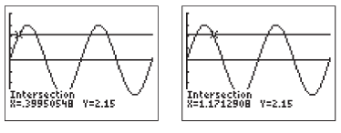

&le; Module 13 - Graphing Cosine and Sine Functions

<!-- TOC -->
* [General Notes](#general-notes)
* [Graphing **x(&theta;) = cos(&theta;)** and **y(&theta;) = sin(&theta;)**](#graphing-xtheta--costheta-and-ytheta--sintheta)
  * [Interval Notation](#interval-notation)
* [Characteristics of Cosine and Sine Functions](#characteristics-of-cosine-and-sine-functions)
* [Transformations of Cosine and Sine Functions](#transformations-of-cosine-and-sine-functions)
  * [Shifting Cosine and Sine Functions](#shifting-cosine-and-sine-functions)
    * [Function Shift Graphing One](#function-shift-graphing-one)
    * [Function Shift Graphing Two](#function-shift-graphing-two)
  * [Reflecting Cosine and Sine Functions](#reflecting-cosine-and-sine-functions)
    * [Function Reflection Graphing One](#function-reflection-graphing-one)
    * [Function Reflection Graphing Two](#function-reflection-graphing-two)
  * [Vertically Stretching and Compressing Cosine and Sine Functions](#vertically-stretching-and-compressing-cosine-and-sine-functions)
    * [Function Vertical Stretch/Compress Graphing One](#function-vertical-stretchcompress-graphing-one)
    * [Function Vertical Stretch/Compress Graphing Two](#function-vertical-stretchcompress-graphing-two)
  * [Horizontally Stretching and Compressing Cosine and Sine Functions](#horizontally-stretching-and-compressing-cosine-and-sine-functions)
    * [Function Horizontal Stretch/Compress Graphing One](#function-horizontal-stretchcompress-graphing-one)
    * [Function Horizontal Stretch/Compress Graphing Two](#function-horizontal-stretchcompress-graphing-two)
  * [Transformed Cosine and Sine Functions](#transformed-cosine-and-sine-functions)
    * [Example Transformed Function](#example-transformed-function)
* [Phase Shifts](#phase-shifts)
  * [Phase Shift Definition](#phase-shift-definition)
  * [Phase Shift Examples](#phase-shift-examples)
    * [Degrees Shift](#degrees-shift-)
    * [Radian Shift](#radian-shift)
  * [Determining Phase Shift](#determining-phase-shift)
* [Solving Trigonometric Equations by Graphing](#solving-trigonometric-equations-by-graphing)
  * [Solving Trigonometric Equations by Graphing Examples](#solving-trigonometric-equations-by-graphing-examples)
    * [Graphing The Function Example One](#graphing-the-function-example-one)
    * [Graphing The Function Example Two](#graphing-the-function-example-two)
  * [Using a Sine Model in a Real-World Context](#using-a-sine-model-in-a-real-world-context)
<!-- TOC -->

# General Notes

# Graphing **x(&theta;) = cos(&theta;)** and **y(&theta;) = sin(&theta;)**

- Change from xy coordinate system &rarr; System with angle measure as the independent variable and trigonometric functions value of the angle as the dependent variable.
  - Angle measure is input
  - Trigonometric function value is output

- The first graph has its  points on the unit circle labeled with their angle measure (in degrees) and the corresponding horizontal (x) position of the endpoint for the corresponding arcs.
  - These are still on the xy-plane.
- The second graph has the same points graphed as **&theta;x-coordinates**.
  - The x-value is on the vertical axis because its the output.
- The x-value does not change as much for the second graph for angles close to **0&deg;** as it does for angles close to **90&deg;**.
  - In the first graph, the same change in the angle measure yields a greater change in the **horizontal component** of each coordinate point as the angle measure approaches **90&deg;** and a greater change in the **vertical component** of each coordinate point when the angle is closer to **0&deg;**.

The same process is used for **y(&theta;) = sin(&theta;):**

To graph the complete circles:

<u>**x(&theta;) = cos(&theta;):**</u>

<u>**y(&theta;) = sin(&theta;):**</u>

## Interval Notation

Inequality representations in <u>interval notation</u>:
- **a &le; x &le; b &rarr; [a, b]**
- **a < x < b &rarr; (a, b)**
- **a &le; x < b &rarr; \[a, b)** 
- **a < x &le; b &rarr; (a, b]**

* The interval **[a, b]** is called a **closed interval** because it _includes_ the endpoints. 
* The interval **(a, b)** is called an **open interval** because it _excludes_ the endpoints. 

Since interval notation is less cumbersome than inequality notation, it is frequently used.

The cosine and sine functions are **periodic**.

Graph of interval **\[0&deg;, 360&deg;]**:

---

Graph of interval **\[0, 2&pi;]**:

# Characteristics of Cosine and Sine Functions

- The graphs of sine and cosine have identical patterns.

The two functions are separated by a horizontal shift of **1&frasl;4** of a period:

# Transformations of Cosine and Sine Functions

## Shifting Cosine and Sine Functions

### Function Shift Graphing One

Graphing:

> **x(&theta;) = cos(&theta;) + 2**
> 
> - &theta; is in degrees

- The graph of **x(&theta;) = cos(&theta;)** is shifted up 2 units.

### Function Shift Graphing Two

Graphing:

> **y(&theta;) = sin(&theta; + 2&pi;&frasl;3)**
> 
> - &theta; is in radians

- The graph of **y(&theta;) = sin(&theta;)** is shifted to the left by **2&pi;&frasl;3** radians.

## Reflecting Cosine and Sine Functions

### Function Reflection Graphing One

Compare the two graphs of:

> 1. **f(&theta;) = sin(&minus;&theta;)**
> 2. **g(&theta;) = &minus;sin(&theta;)**

- The graph of **f(&theta;) = sin(&minus;&theta;)** is a <u>_horizontal reflection_</u> of the graph of **y(&theta;) = sin(&theta;)**.
- The graph of **g(&theta;) = &minus;sin(&theta;)** is a <u>_vertical reflection_</u> of the graph of **y(&theta;) = sin(&theta;)**.
- The graphs of **f(&theta;) = sin(&minus;&theta;)** and **g(&theta;) = &minus;sin(&theta;)** are identical, meaning the sine function has **odd symmetry**.

### Function Reflection Graphing Two

Compare the two graphs below:

> 1. **h(&theta;) = cos(&minus;&theta;)**
> 2. **j(&theta;) = &minus;cos(&theta;)**

- The graph of **h(&theta;) = cos(&minus;&theta;)** is a <u>_**not a** horizontal reflection_</u> of the graph of **x(&theta;) = cos(&theta;)**.
  - The graphs are symmetric on the y-axis, meaning the cosine function has **even symmetry** and a horizontal reflection won't change the shape of the graph.
- The graph of **j(&theta;) = &minus;cos(&theta;)** is a <u>_vertical reflection_</u> of the graph of **x(&theta;) = cos(&theta;)**.

## Vertically Stretching and Compressing Cosine and Sine Functions

Vertical stretches and compressions affect the amplitude of trigonometric functions.

- The new amplitude of a vertically stretched cosine or sine function will be identified to the vertical stretch factor.

### Function Vertical Stretch/Compress Graphing One

Given the following function in degrees:

> **x(&theta;) = 5cos(&theta;)**

- This shows the graph of **x(&theta;) = cos(&theta;)** stretched vertically by a factor of 5.

### Function Vertical Stretch/Compress Graphing Two

Given the following function in degrees:

> **y(&theta;) = 2&frasl;5&thinsp;sin(&theta;)**

- This shows the graph of **y(&theta;) = sin(&theta;)** compressed vertically by a factor of **2&frasl;5**.

## Horizontally Stretching and Compressing Cosine and Sine Functions

### Function Horizontal Stretch/Compress Graphing One

Graphing and interpreting the following function with reference to the unit circle:

> **x(&theta;) = cos(4&theta;)**

- **4&theta;** causes the graph to change **4 times** as fast as the graph of **x(&theta;) = cos(&theta;)**. This causes the to have a period that is one-fourth the period of **360&deg;**
  - This makes the period of **x(&theta;) = cos(4&theta;)** **90&deg;**, or **&pi;&frasl;2** _**(2&pi;&frasl;4)**_ radians.
- The **4** in **x = cos(4&theta;)** is called the **angular frequency**.
  - _The number of periods the function will complete as &theta; changes by
    360&deg; or 2&pi; radians._

### Function Horizontal Stretch/Compress Graphing Two

Graphing and interpreting the following function with reference to the unit circle: 

> **y(&theta;) = sin(1&frasl;2&thinsp;&theta;)**

## Transformed Cosine and Sine Functions

- When graphing transformed cosine and sine functions, it is helpful to first graph the untransformed function and then apply the transformations in the following order:
  1. **Horizontal Compression/Stretch** _(angular frequency)_
  2. **Horizontal Shift** _(phase shift or horizontal shift)_
  3. **Vertical Compression/Stretch** _(amplitude)_
  4. **Vertical Shift** _(vertical shift)_

### Example Transformed Function

# Phase Shifts

When the function is written as **y(&theta;) = -sin(2(&theta; + &pi;&frasl;6)) - 5**, it is the expanded form with the horizontal shift hidden.

- Now we have the **phase shift**.

## Phase Shift Definition

The **phase shift** is the _portion of one period_ by which the function is shifted horizontally instead of the _amount_ it is shifted.

## Phase Shift Examples

### Degrees Shift 

> **x(&theta;) = 4&frasl;3&thinsp;cos&thinsp;(1&frasl;4&thinsp;(&theta; - 180))**

After distributing the **1&frasl;4**, we get:

> **x(&theta;) = 4&frasl;3&thinsp;cos&thinsp;(1&frasl;4&thinsp;&theta; - 45)**

- The **phase shift** is **45&deg;** to the **right**.
- This means that shifting the graph **180&deg;** is equivalent to shifting the graph **45&frasl;360** of one period.
  - Or **1&frasl;8** when reduced further

### Radian Shift

> **y(&theta;) = &minus;sin(2(&theta; + &pi;&frasl;6)) - 5**

After distributing the **2**, we get:

> **y(&theta;) = &minus;sin(2&theta; + &pi;&frasl;3) - 5**

So we need to shift the graph horizontally a portion of one period equal to **&pi;&thinsp;&frasl;&thinsp;3&frasl;2&pi;**:

- Shifting the graph left by **&pi;&frasl;6** means that we are shifting it left **1&frasl;6** of one period.

## Determining Phase Shift

# Solving Trigonometric Equations by Graphing

- Graphing the functions gives the ability to find the angle given the values of cosine and sine.

## Solving Trigonometric Equations by Graphing Examples

### Graphing The Function Example One

Given:

> **cos(&theta;) = 0.33**

To get the angle:

1. Graph two functions:
   1. **y1 = cos(&theta;)**
   2. **y2 = 0.33**
2. Adjust the view to only see points between **0** and **2&pi;**
3. Find the intersection of the two functions
4. 
5. Angles measuring **1.2345 radians** and **5.0487 radians** have cosine values equal to **0.33**.

### Graphing The Function Example Two

Given:

> **3&thinsp;sin(2&hairsp;&theta;) = 2.15**

1. Graph two functions:
   1. **y1 = 3&thinsp;sin(2&hairsp;x)**
   2. **y2 = 2.15**
2. Adjust the view to only see points between **0** and **2&pi;**
3. Note that the sine function is being compressed horizontally by a factor of **1&frasl;2**.
   - This means that as &theta; changes from 0 to 2&pi; we will have two periods of sine, giving us four solutions to this equation on the interval **\[0,2&pi;]**.
4. 
5. You can use the same process for the above example or add &pi; to each solution since they will be in the same positions in the second period.
6. A vertical position of **2.15** occurs when **&theta;** is **0.3995, 1.1713, 3.5411, 4.3129 radians**.

## Using a Sine Model in a Real-World Context

Given a function to model the number of hours of daylight in Seattle **d** days after March 21, 2020:

> **H(d) = 3.78&hairsp;sin(2&pi;&frasl;365&hairsp;d) + 12.2**

<u>Finding The Period:</u>

1. The sine function is stretched horizontally by a factor of **365&frasl;2&pi;**.
   - The original period was **2&pi;**, but the new period is **365** faster, making it **365&frasl;2&pi;** _**(365&frasl;2&pi; &times; 2&pi; = 365)**_
   - **2&pi;&frasl;|&hairsp;B&hairsp;|** can also be used to calculate the period.
2. The period of the function is **365**.
   - This means that the function will complete one cycle every **365** days.

<u>Finding Other Attributes:</u>
- Midline: **H = 12.2**
- Amplitude: **A = 3.78 hours**
- Max and min:
  - **Max = 12.2 + 3.78 = 15.98 hours**
  - **Min = 12.2 - 3.78 = 8.42 hours**
