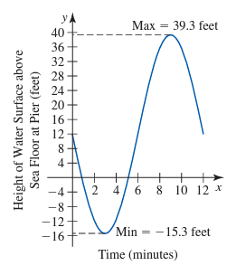
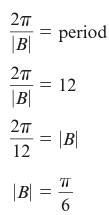
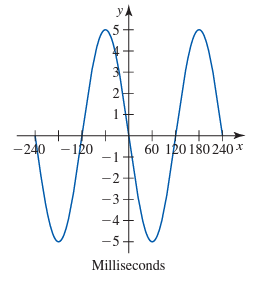

# Module 14 - Modeling With Trigonometric Functions

<!-- TOC -->
* [Module 14 - Modeling With Trigonometric Functions](#module-14---modeling-with-trigonometric-functions)
* [General Notes](#general-notes)
* [Generating a Sinusoidal Model from a Verbal Description](#generating-a-sinusoidal-model-from-a-verbal-description)
* [Generating a Sinusoidal Model from a Table of Data](#generating-a-sinusoidal-model-from-a-table-of-data)
* [Generating an Equation from the Graph of a Sinusoid](#generating-an-equation-from-the-graph-of-a-sinusoid)
<!-- TOC -->

# General Notes

# Generating a Sinusoidal Model from a Verbal Description

Given the text:

> _"Tsunami waves generated by an earthquake of magnitude 7.8 on the Richter scale occur 10 to 20 minutes apart and travel at speeds greater than 500 miles per hour. The amount of time between successive wave crests, known as the wave period, varies from only a few minutes to more than an hour. When the April 1946 tsunami hit Laupahoehoe Point, Hawaii, it had a 27.3-foot amplitude (from normal level) and a wave period of 12 minutes. (Source: www.wcatwc.gov)"_

Graphing the problem:

- **12 feet** is the **vertical intercept** and **midline** because this is the height of the water surface above the sea floor initially.
- **27.3 feet** is the **amplitude**
  - **Maximum** and **Minimum** values:
    - Maximum: **12 + 27.3** &rarr; **39.3 feet**
    - Minimum: **12 - 27.3** &rarr; **-15.3 feet**
- The problem says that it decreases before returning to its original height, which means that it should start off going down.
- The **period** is **12 minutes**.
  - The height should return to its initial height by this time.
- Function to model the data: **d(t) = -27.3 sin(2&pi;&frasl;12t) + 12**
  - **B** was found by: 

# Generating a Sinusoidal Model from a Table of Data

The background:

> _"The Willis Tower (formerly the Sears Tower) in Chicago was designed to be flexible enough to bend rather than break in strong winds, but rigid enough so people are comfortable working and living in it without feeling the movements of the building. (Source: www.911research.wtc7.net)  
> On a windy Chicago day (35-mph winds), the distance, s, that the top of the Willis Tower sways varies sinusoidally with the time, t, in seconds. For such days, engineers have designed the tower to sway a maximum distance of 12 inches from vertical in each direction. (Source: www.dupont.com) Table 8.9 gives hypothetical sway distances for specific times based on a sinusoidal function."_

|  Time (seconds) t  |  Sway Distance from Vertical (inches) d  |
|:--------------------------:|:------------------------------------------------:|
|             0              |                       0.0                        |
|             6              |                       6.0                        |
|             12             |                       10.4                       |
|             18             |                       12.0                       |
|             24             |                       10.4                       |
|             30             |                       6.0                        |
|             36             |                       0.0                        |
|             42             |                       -6.0                       |
|             48             |                      -10.4                       |
|             54             |                      -12.0                       |
|             60             |                       10.4                       |
|             66             |                       -6.0                       |
|             72             |                       0.0                        |

- Amplitude 
  - **= max - min&frasl;2**
  - **= 12 - (-12)&frasl;2** 
  - **= 12**
- Midline &rarr; **y = 0**
  - **= max + min&frasl;2**
  - **= 12 + (-12)&frasl;2** 
  - **= 0**
- Period is **72 seconds**
  - It takes that long for the data to do a complete cycle and return to the starting value.
- Frequency is **1&frasl;72**
  - The reciprocal of the period
  - The portion of a period that occurs over a 1-second interval is **1&frasl;72**
- A sine function model would be used to model this because the function values start at the midline, increase to the maximum value, decrease to the minimum value, and return to the midline.
  - The sine function is **y(&theta;) = A&hairsp;sin(B(&theta; - C)) + D**
  - **A = 12**
  - **C = 0**
  - **D = 0**
  - **B = &pi;&frasl;36**
    - **B = 2&pi;&frasl;period &rarr; 2&pi;&frasl;72 &rarr; &pi;&frasl;36**

# Generating an Equation from the Graph of a Sinusoid

Given the info and graph:

> _"Pure sounds produce single sine waves on an oscilloscope. On the vertical scale, the voltage is measured with each increment representing 0.5 volts, and on the horizontal scale each increment represents 30 milliseconds."_

<u>Graph:</u>

<u>Sine Function:</u>

- Amplitude: **|&hairsp;A&hairsp;| &rarr; 5 &rarr; -5**
  - The height on the graph is **5** above the midline of **0**.
  - Note the graph is a reflection of the standard sine function because it decreases after 0 milliseconds instead of increasing. This means it is **-5** instead of just **5**.
- Period: **1.5**
  1. The standard period for a sine wave is 360.
  2. This sine wave has a full cycle of 240.
  3. **360&frasl;240 &rarr; 1.5**
- Vertical & Horizontal Shift: **0**
- Final sine function: **y(&theta;) = -5&hairsp;sin(1.5&hairsp;&theta;)**

<u>Cosine Function:</u>

- Everything is the same except for the horizontal shift, making the new function: **y(&theta;) = -5&hairsp;sin(1.5&hairsp;&theta; + 60)**
  - The maximum occurs at **-60** instead of **0 milliseconds**.
- In a standard sine or cosine function, the maximum value occurs at different places. 
  - For a sine function, **y(&theta;) = sin(&theta;)**, the maximum value occurs at **x = 90 degrees** **_(&pi;&frasl;2 radians)_**.
  - For a cosine function, **y = cos(x)**, the maximum value occurs at **x = 0 degrees _(0 radians)_**. 
- When you have a sine function, and you want to convert it to a cosine function, you need to account for this difference in where the maximum value occurs. 
  - This is done by shifting the graph horizontally, also known as a **phase shift** or **horizontal shift**.